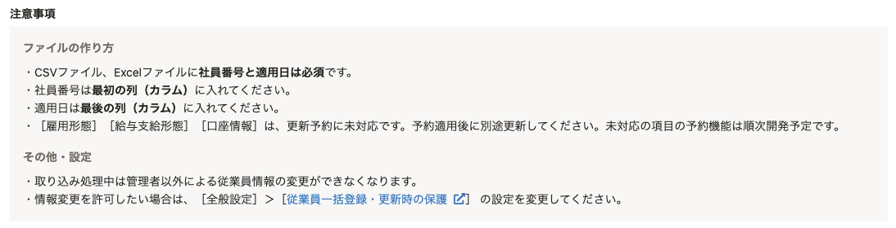
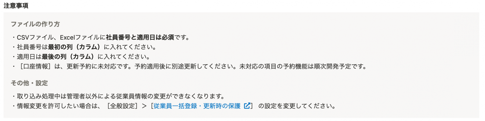
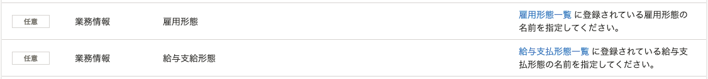

2021年9月24日（金）に行なったアップデートの詳細をお知らせします。

SmartHR基本機能の変更点は、新機能1件でした。

# ✨ 新機能

## 雇用形態と給与支給形態も予約して更新できるようにしました

これまで更新予約に未対応だった **［雇用形態］** と **［給与支給形態］** の2項目を予約して更新できるようにしました。

このアップデートで、従業員情報の未対応項目は **［口座情報］** のみとなりました。

 **［口座情報］** の更新予約も、今後対応を予定しています。

画面上の変更箇所は下記のとおりです。

 **［注意事項］** 

| 変更前 | 変更後 |
| --- | --- |
|  |  |

 **［各セルに入力可能な文字列一覧］** 

:::related
[予約管理機能とは](https://knowledge.smarthr.jp/hc/ja/articles/4403483379097)
[予約を追加する](https://knowledge.smarthr.jp/hc/ja/articles/4403491370521)
[予約の内容を確認する](https://knowledge.smarthr.jp/hc/ja/articles/4403483367577)
[予約を削除する](https://knowledge.smarthr.jp/hc/ja/articles/4403491360025)
:::
