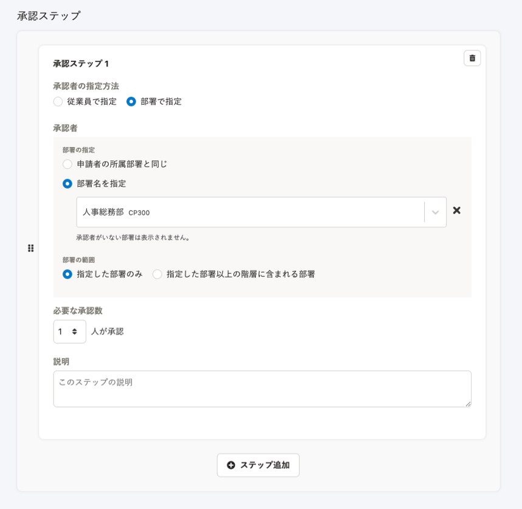
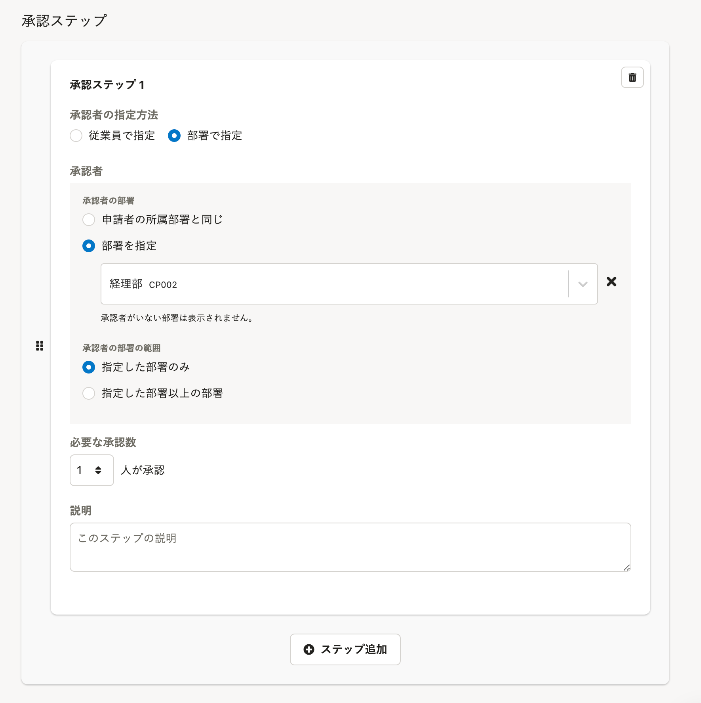

2021年9月28日（火）に行なったアップデートの詳細をお知らせします。

SmartHR基本機能の変更点は、カイゼン1件・不具合修正3件でした。

# 📈 カイゼン

## 承認経路の新規登録・編集画面の文言を変更しました

申請の承認経路を新規登録・編集する際に表示される **［承認ステップ］** の文言とデザインを以下のとおり変更しました。

今後の開発に向けた対応になります。

- ［部署の指定］→［承認者の部署］
- ［部署名を指定］→［部署を指定］
- ［部署の範囲］→［承認者の部署の範囲］
- ［指定した部署以上の階層に含まれる部署］→［指定した部署以上の部署］
- ［承認者の部署の範囲］のラジオボタンの配置を縦並びに変更

| 変更前 | 変更後 |
| --- | --- |
|  |  |

# 👨‍⚕️ 不具合修正

賞与支払届を作成した際の書類の反映に関する修正など、3件の不具合修正を行ないました。
