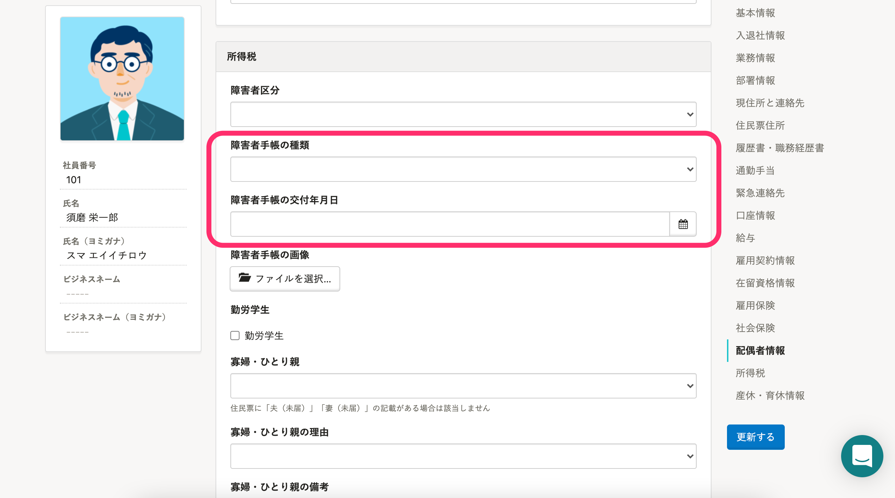

2021年10月12日（火）に行なったアップデートの詳細をお知らせします。

SmartHR基本機能の変更点は、カイゼン1件でした。

# 📈 カイゼン

## 従業員情報・家族情報に［障害者手帳の種類］と［障害者手帳の交付年月日］の項目を追加し、一部の項目名を変更しました

従業員情報と年末調整機能の間に不足や差異のある項目をカイゼンしました。

これまでは年末調整で必要となる項目のうち、［障害者手帳の種類］と［障害者手帳の交付年月日］は、従業員項目・家族情報にありませんでした。

これらの項目は年末調整以外にも必要な情報になるため、従業員情報の **［所得税］** 欄に **［障害者手帳の種類］** と **［障害者手帳の交付年月日］** を追加しました。

あわせて、実際に入力されるべき情報と項目名が異なっていたり、表記ルールに沿っていなかったりした箇所をカイゼンしています。

詳しくは、下記のお知らせをご覧ください。

[【10/13追記】2021年10月12日（火）にシステム標準項目・家族情報の項目を追加・一部の項目名を変更しました](https://smarthr.jp/update/26541)

:::related
[【一覧】2021年10月12日以降で追加・変更された項目名](https://knowledge.smarthr.jp/hc/ja/articles/4406354011545)
:::
