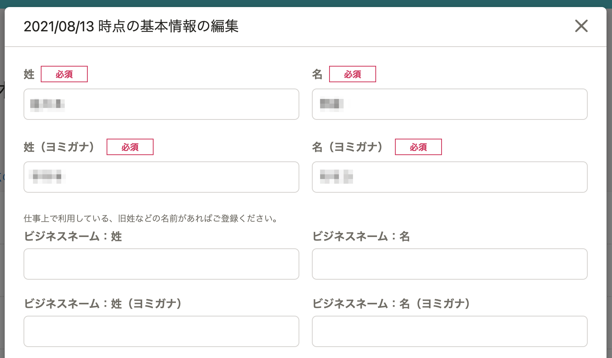
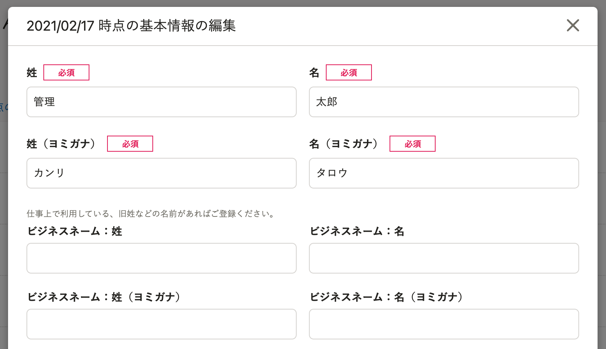
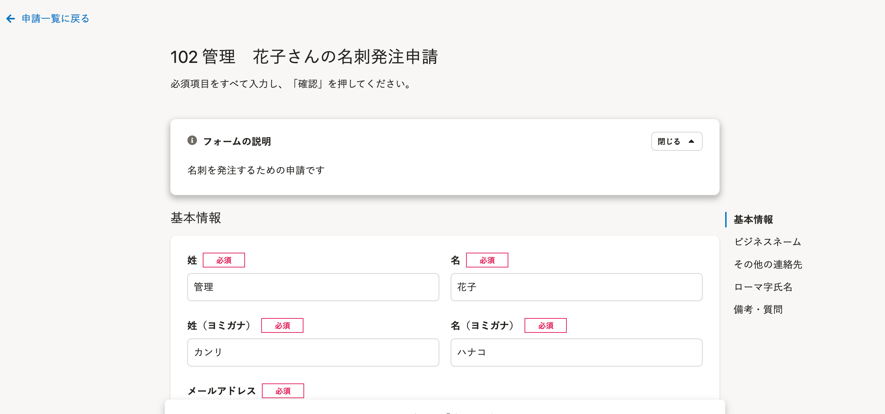
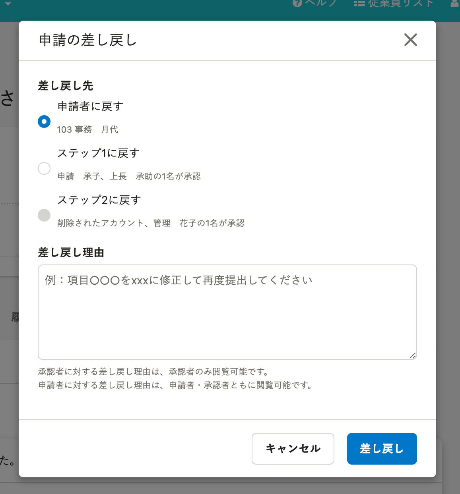
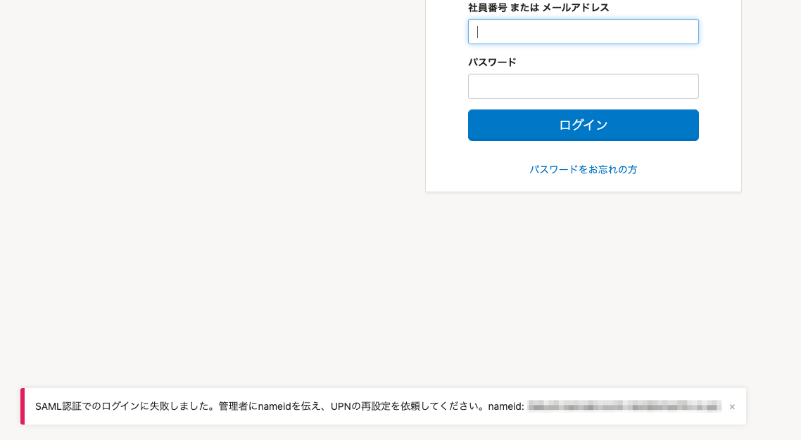

2021年10月14日（木）に行なったアップデートの詳細をお知らせします。

SmartHR基本機能の変更点は、カイゼン2件・不具合修正2件でした。

# 📈 カイゼン

## 履歴編集のダイアログと申請フォームのラベルの色を変更しました

履歴を直接編集する際に表示されるダイアログと、申請フォーム画面と申請の差し戻しの際に表示されるダイアログ内のラベルの色を、グレーから黒に変更しました。

履歴の編集ダイアログ

| 変更前 | 変更後 |
| --- | --- |
|  |  |

申請フォーム画面

［申請の差し戻し］ダイアログ

## SAML SSOでのログインに失敗した際のメッセージを変更しました

SAML SSOでのログインに失敗した場合のメッセージを下記のとおり変更しました。

SAML SSOアカウントの設定が原因でログインできない場合は、原因を明記して特定できるようにしています。

変更前：外部連携 SAML のアカウント情報と SmartHR のアカウント情報が連携できませんでした。管理者に確認を依頼してください。

変更後：SAML認証でのログインに失敗しました。管理者にnameidを伝え、UPNの再設定を依頼してください。

:::related
[SAML認証（SSO）を使ってログインする](https://knowledge.smarthr.jp/hc/ja/articles/360037085933)
:::

# 👨‍⚕️ 不具合修正

従業員情報の更新に関する修正など、2件の不具合修正を行ないました。
