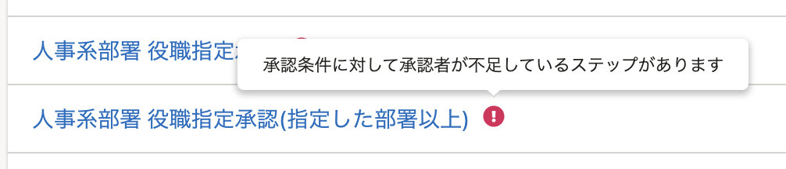
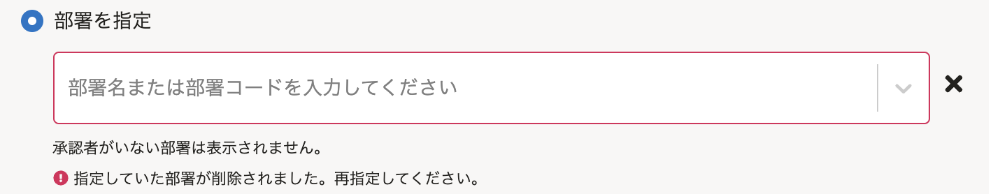
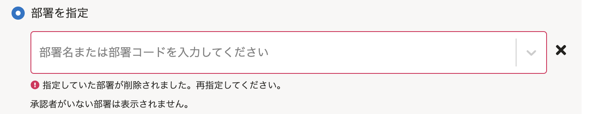
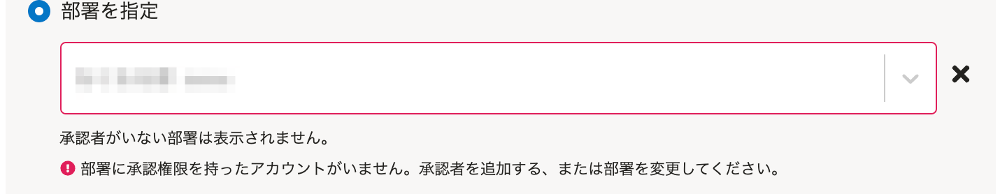
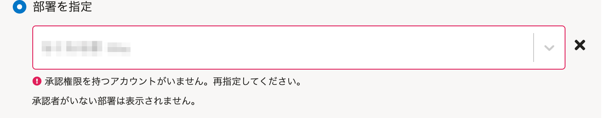

2021年10月22日（金）に行なったアップデートの詳細をお知らせします。

SmartHR基本機能の変更点は、カイゼン1件でした。

# 📈 カイゼン

## 申請の経路一覧と経路の詳細画面の文言を変更しました

申請の経路一覧と経路の詳細画面で、承認者が不足している場合に表示される文言を下記のとおり変更しました。

**申請の経路一覧画面**

承認者が足りない経路名に表示されるエラーメッセージに句点をつけました。

| 変更前 |  |
| --- | --- |
| 変更後 |  |

**申請の経路詳細画面**

 **［部署を指定］** の欄で、経路に含まれる部署が削除されている場合に表示されるエラーメッセージと、ヒント文を並べ替えました。

| 変更前 |  |
| --- | --- |
| 変更後 |  |

 **［部署を指定］** の欄で、経路に含まれる部署に承認者が存在しない場合に表示されるエラーメッセージの内容を変更し、エラーメッセージとヒント文を並べ替えました。

| 変更前 |  |
| --- | --- |
| 変更後 |  |
