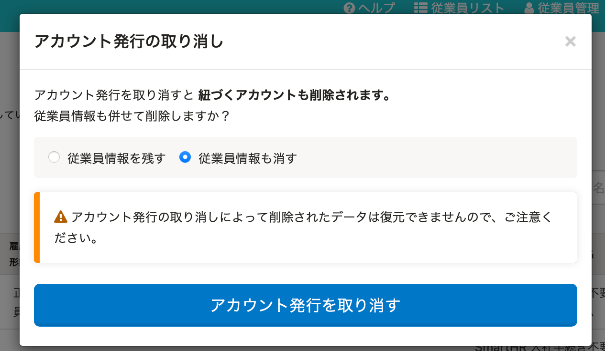

2021年11月1日（月）に行なったアップデートの詳細をお知らせします。

SmartHR基本機能の変更点は、カイゼン1件でした。

# 📈 カイゼン

## 招待を取り消す際に、一緒に従業員情報も削除したあと、同じ社員番号で従業員を追加した場合でも過去日の履歴を追加できるようにしました

招待を取り消す際に、一緒に従業員情報も削除する場合の挙動をカイゼンしました。

これまでは、招待の取り消しと同時に従業員情報も削除したとき、そのあとに同じ社員番号の別従業員を追加した場合は、前の従業員を削除した日より過去の日付に履歴を追加できませんでした。

そのため今回の改修により、同一社員番号で別の従業員を追加した場合、削除した従業員情報が存在した期間に対しても、新しく追加した従業員の履歴を追加できるようにしました。

 **［従業員管理］>［SmartHR に招待］** で **［こちら］** をクリックして表示される **［アカウント発行中の従業員］** 画面での操作になります。

