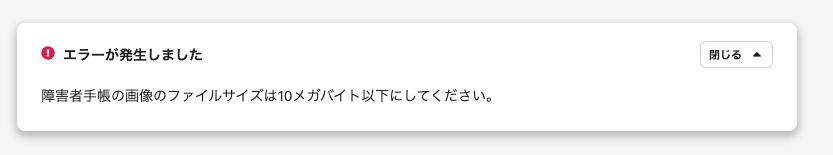
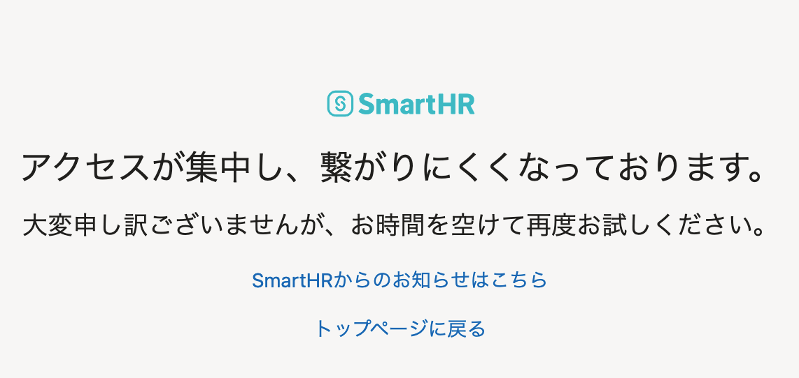

2021年11月2日（火）に行なったアップデートの詳細をお知らせします。

SmartHR基本機能の変更点は、カイゼン3件でした。

# 📈 カイゼン

## 申請や手続き時に添付ファイルのサイズが10MBを超えている場合のエラーメッセージをわかりやすくしました

これまでは、申請フォームや手続き、従業員情報編集などで添付ファイルを追加する際、ファイルサイズが上限の10MBを超えた場合に表示されるエラーメッセージが不明瞭なものでした。

エラーの原因を明確して自己解決しやすくするため、10MBを超えるファイルが含まれていた場合、下図のエラーメッセージを表示するようにしました。

## SmartHRにアクセスが集中して繋がりにくいことをお伝えする画面を用意しました

SmartHRにアクセスが集中し、一時的に繋がりにくくなってしまっている場合に表示させる専用のメッセージを用意しました。

大変申し訳ございませんが、このメッセージが表示された場合は、お時間を空けて再度アクセスをお試しください。

## ログインしていない状態でオプション機能のURLを開いた場合、ログイン後に移動するページを変更しました

これまでは、SmartHRにログインしていない状態でオプション機能のURLを開いた場合、ログイン後はSmartHRのトップ画面を表示していました。

SmartHRのトップ画面から移動する手間を減らすため、オプション機能のURLを経由してログインした場合は、ログイン後に直接オプション機能を表示するように変更しました。
