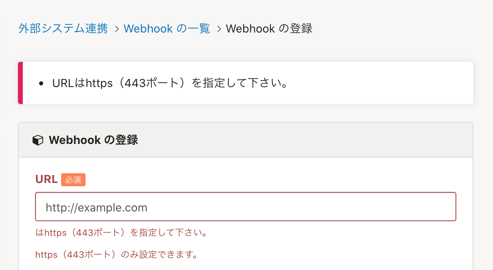
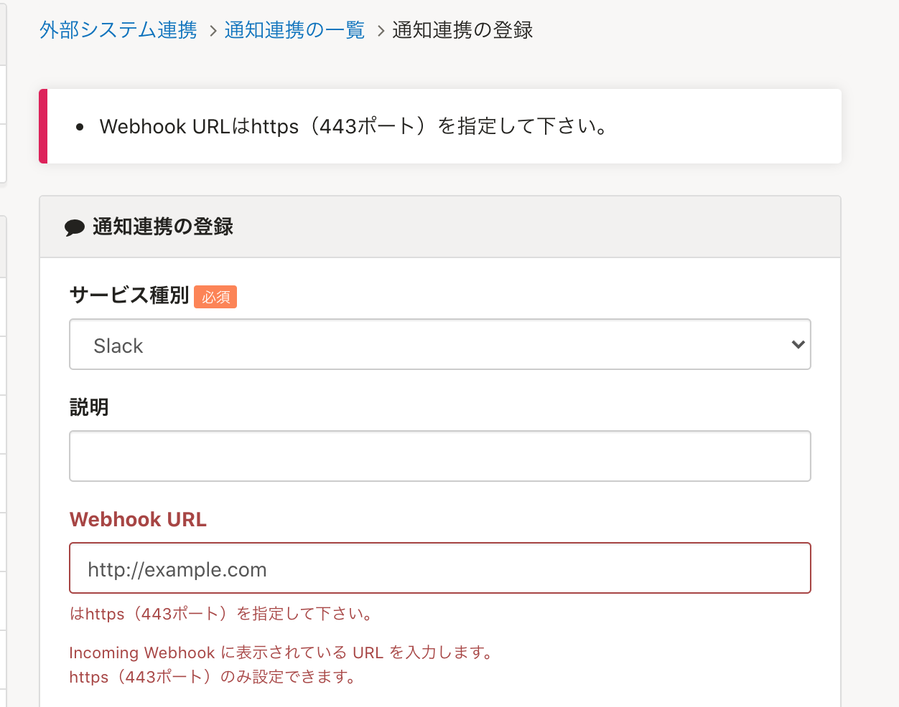

2021年11月8日（月）に行なったアップデートの詳細をお知らせします。

SmartHR基本機能の変更点は、カイゼン2件でした。

# 📈 カイゼン

## メールの宛名に従業員の氏名を表示するようにしました

これまでは、SmartHRからメールを送信した際、氏名が登録してある場合でもメールアドレスが宛名として表示されていました。

今回の改修で、従業員にメールを送信した際や、情報が更新された際の通知メールの宛名は、従業員氏名を宛名として表示するようにしました。

以前の改修で未対応だった、以下のメールの宛名が対象になります。

※ 氏名が未記入の場合や従業員情報とアカウントが紐付いていない場合は、引き続きメールアドレスが表示されます。

- メールアドレスを変更した際の、管理者への通知メールの宛名
- 招待が完了した際の、従業員への通知メールの宛名
-  **［共通設定］** のメールフォーマットのアカウント登録完了メールで表示されている宛名
-  **［共通設定］** のメールアドレスアカウントから招待した際のメールの宛名
- 年末調整機能のCSVとPDFのエクスポートをした際の通知メールの宛名

:::related
[2021/03/22 招待メールの宛名に従業員の氏名を表示するようにしました 他1件](https://knowledge.smarthr.jp/hc/ja/articles/900005308426)
:::

## SmartHRと通知連携を登録する際のWebhook URLは、https（443ポート） のみにしました

SmartHRで更新した情報を通知する際のWebhook URLは、https（443ポート） のみ登録できるようにしました。

セキュリティ強化のカイゼンになります。

対応箇所は下図のとおりです。

 **［共通設定］>［外部システム連携］> WebhookのURL** 

 **［共通設定］>［外部システム連携］> 通知連携のWebhook URL** 

 **［サービス種別］** で、Slack またはTeamsを選択したときのみ表示されます。

