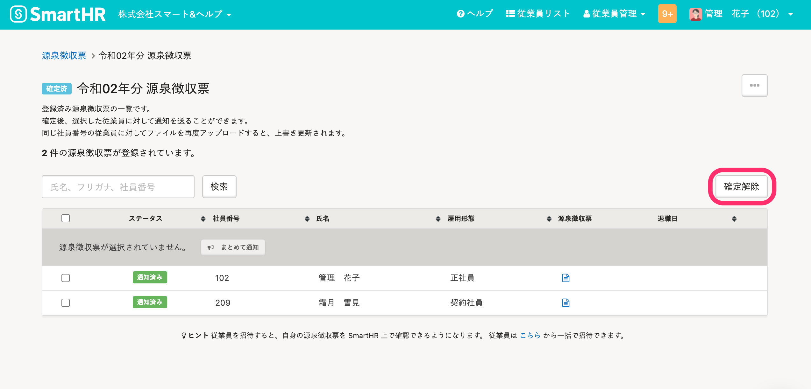
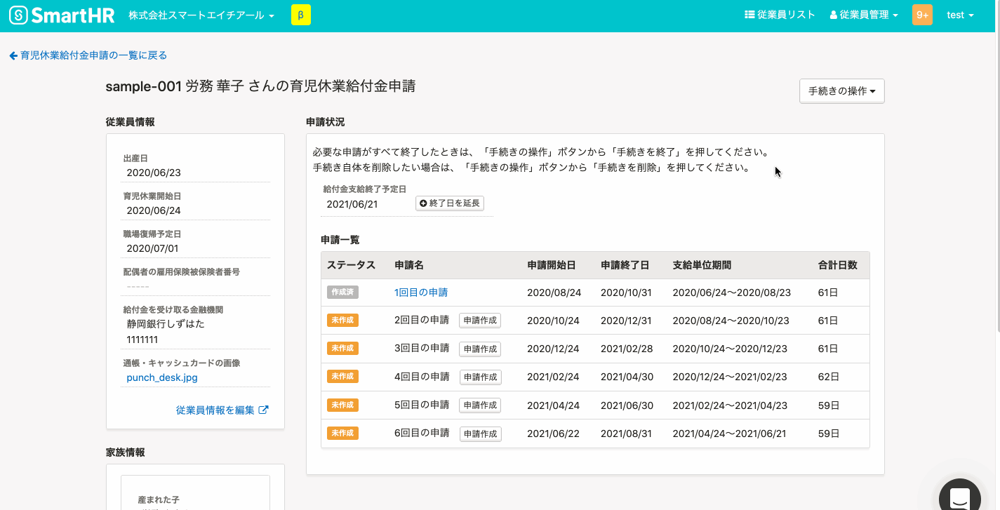

2021年11月10日（水）に行なったアップデートの詳細をお知らせします。

SmartHR基本機能の変更点は、新機能1件・カイゼン2件でした。

# ✨ 新機能

## 確定済みの源泉徴収票を未確定に戻せるようにしました

確定済みの源泉徴収票を未確定に戻せるようにし、対象の源泉徴収票を個別に編集できるようにしました。

これまでは、確定済みの源泉徴収票を修正したい場合、源泉徴収票グループを削除し、全従業員分のデータを再度作成して登録する必要がありました。

今回のリリースで、源泉徴収票を個別に編集できるようにし、修正対象以外の源泉徴収票のデータを用意する手間を解消しました。

詳細は、下記のお知らせをご覧ください。

[【源泉徴収票機能】確定済みの源泉徴収票一覧を未確定に戻し、源泉徴収票を追加・更新できるようになりました](https://smarthr.jp/update/29982)

# 📈 カイゼン

## 給与明細のCSVファイルを取り込む際の挙動をカイゼンしました

給与明細のCSVファイルを取り込む際に、ファイルに空行が多数ある場合、処理に時間がかかることがありました。

そのため、内部動作を見直し処理速度をカイゼンしました。

## 電子申請送信済みの育児休業給付金申請がある場合でも、手続きを削除できるようにしました

これまでは、削除する育児休業給付金申請に紐づく手続きのいずれかが電子申請送信済みの場合、育児休業給付金申請の手続きを一括で削除できませんでした。

1回ごとに手続きを削除する必要があり手間がかかっていたため、育児休業給付金申請の手続きを一括で削除できるようにしました。

送信済みの電子申請の公文書は引き続き閲覧できます。

| 変更前 |  |
| --- | --- |
| 変更後 |  |
