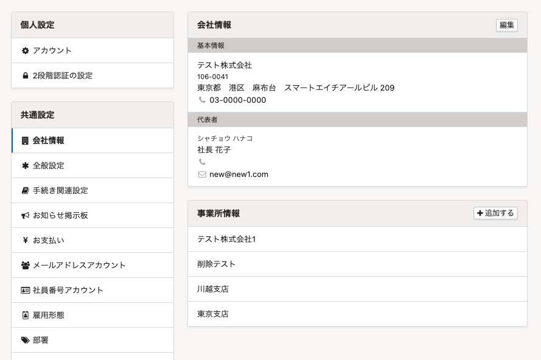
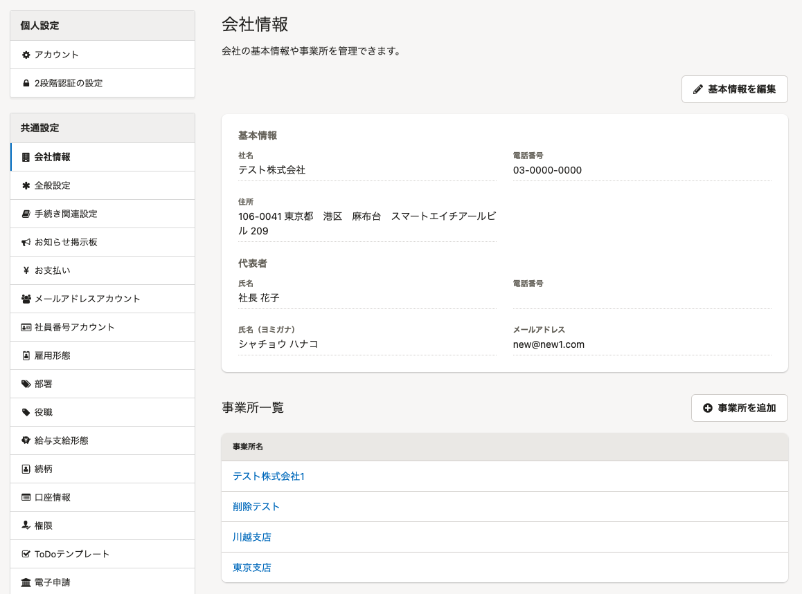

2021年11月11日（木）に行なったアップデートの詳細をお知らせします。

SmartHR基本機能の変更点は、カイゼン1件でした。

# 📈 カイゼン

## ［会社情報］の画面を新しいデザインに変更しました

 **［共通設定］>［会社情報］** の画面を新しいデザインに変更しました。

SmartHR全体のデザインにあわせて、ラベル名やカラー、配置の調整などを行なっています。

| 変更前 | 変更後 |
| --- | --- |
|  |  |
