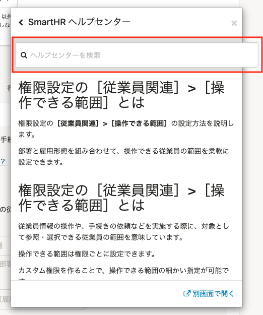
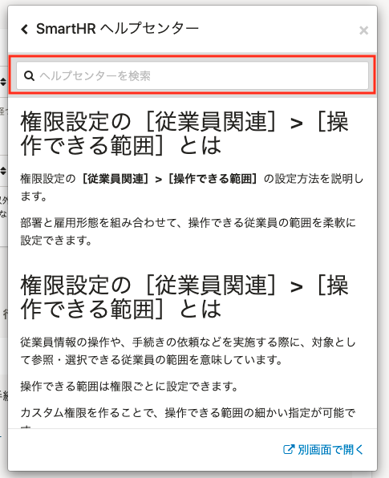

2021年11月17日（水）に行なったアップデートの詳細をお知らせします。

SmartHR基本機能の変更点は、改善1件でした。

# 📈 改善

## ヘルプセンターの検索ボックスのスタイルを調整しました

ヘルプページへのリンクをクリックした際に表示されるウィンドウで、検索ボックスが枠からはみ出る場合があったため、スタイルを調整してはみ出ないようにしました。

| 変更前 | 変更後 |
| --- | --- |
|  |  |
