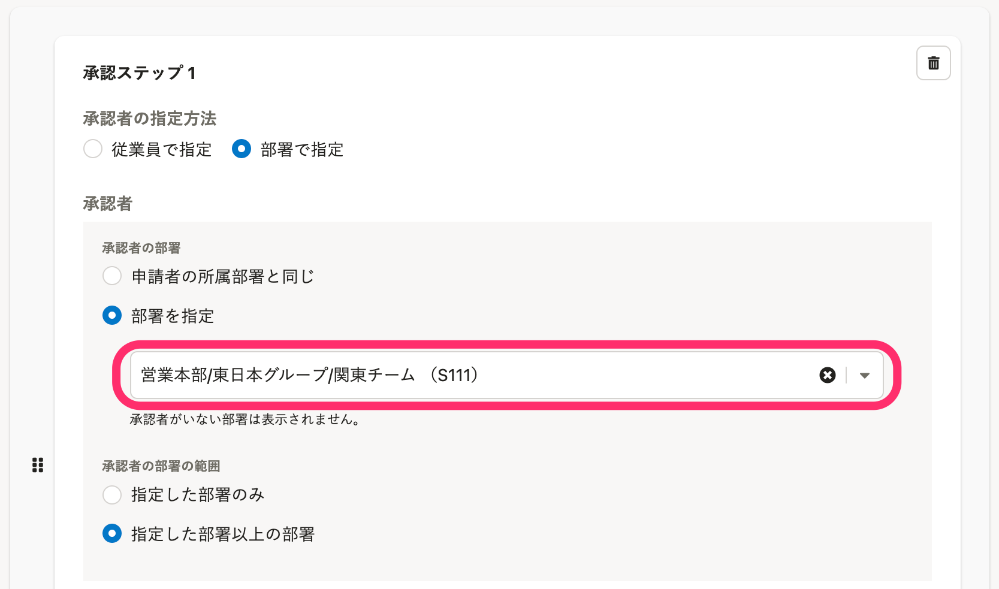

2021年11月19日（金）に行なったアップデートの詳細をお知らせします。

SmartHR基本機能の変更点は、改善1件・不具合修正1件でした。

# 📈 改善

## ［申請］>［経路］の承認ステップのデザインを変更しました

 **［申請］>［経路］** の作成・編集画面で、承認ステップを設定する際の部署選択のボックスを、SmartHR全体のデザインにあわせて変更しました。

| 変更前 | 変更後 |
| --- | --- |
|  |  |

# 👨‍⚕️ 不具合修正

カスタムダウンロードフォーマットのダウンロード項目の編集をする際の挙動に関する1件の不具合修正を行ないました。
