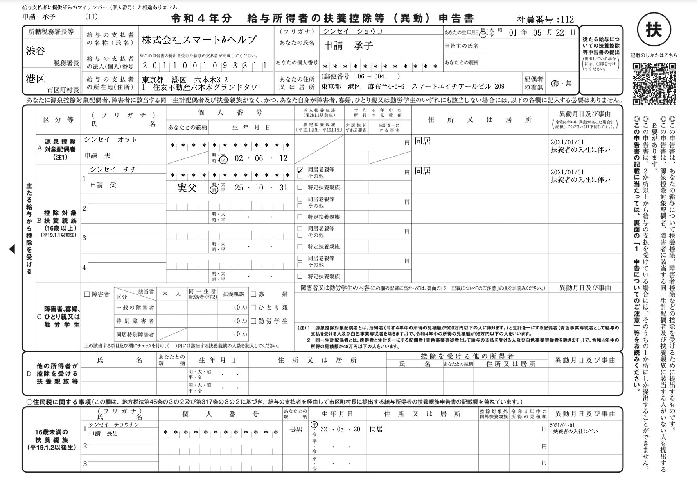
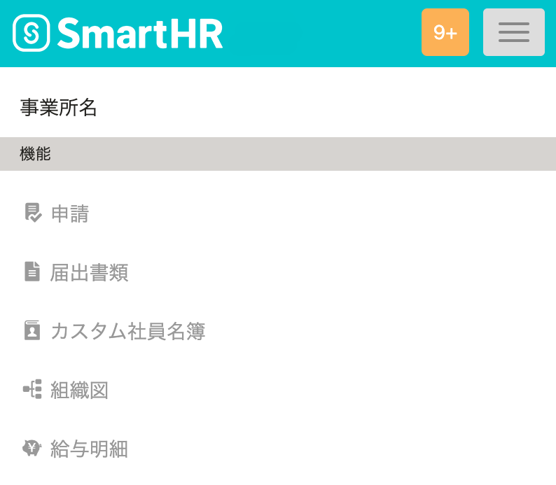
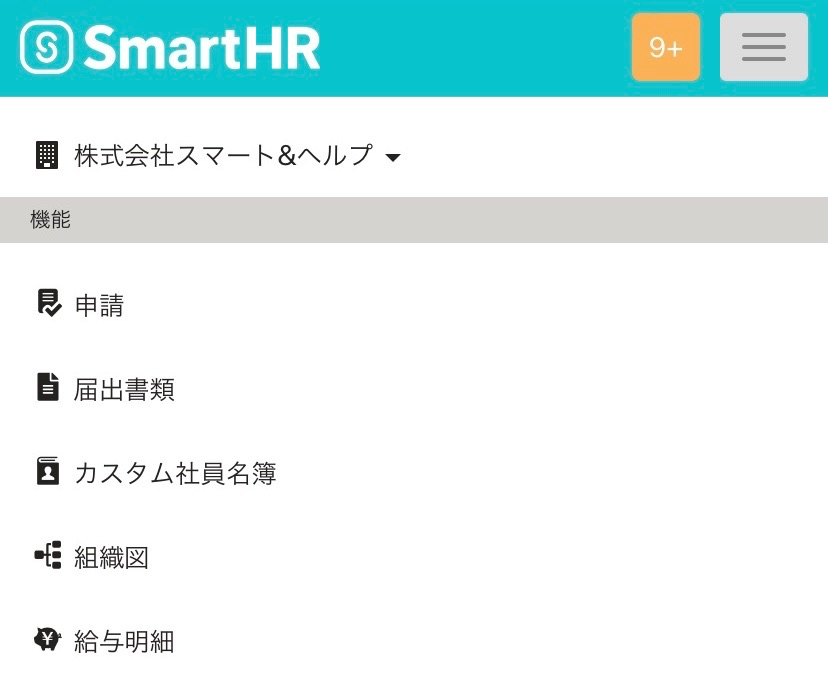

2021年11月29日（月）に行なったアップデートの詳細をお知らせします。

SmartHR基本機能の変更点は、新機能1件・改善2件でした。

# ✨ 新機能

## 令和4年版の「給与所得者の扶養控除等の（異動）申告書」に対応しました

入社の手続き・扶養追加の手続き・扶養削除の手続きで令和4年版の「給与所得者の扶養控除等の（異動）申告書」も作成できるようになりました。

入社する日、扶養追加または削除する日を令和4年の日付にして手続きを作成すると、令和4年版の様式が適用されます。

あわせて、以下を変更しました。

- 申告書の記載例を説明したページにアクセスするQRコードを右上に印字
- 右上の社員番号と「扶」の文字が重ならないように位置を調整

# 📈 改善

## トップ画面にアクセスする際の表示速度を改善しました

作成済みの手続きが大量にある場合、トップ画面を開く際に処理に時間がかかることがあったため、内部動作を見直しパフォーマンスを改善しました。

# 🎢 アクセシビリティ

## スマートフォン版のメニューの文字色を濃くしました

これまでは、スマートフォン版のメニューの文字色が薄いグレーのため、操作できない印象を与えることがありました。

今回のリリースで、文字色を濃くすることで視認性を向上させました。

トップページ >  **［≡］** をタッチすると確認できます。

| 変更前 | 変更後 |
| --- | --- |
|  |  |
