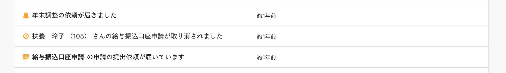
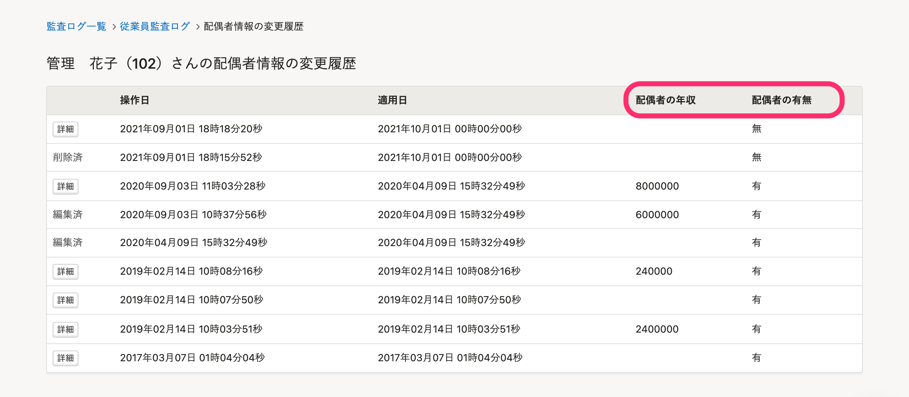
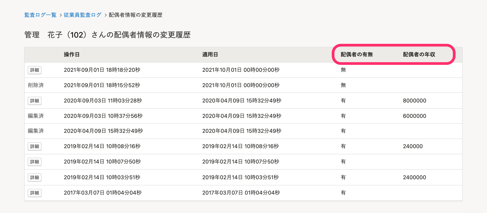

2021年11月30日（火）に行なったアップデートの詳細をお知らせします。

SmartHR基本機能の変更点は、改善4件でした。

# 📈 改善

## ［通知履歴］にプロフィール画像を表示しないようにしました

個人情報の観点から、 **［通知履歴］** 欄にプロフィール画像を表示しないように変更しました。

| 変更前 | 変更後 |
| --- | --- |
|      |  |

## 配偶者情報の監査ログの項目を従業員情報の順番と揃えました

 **［監査ログ］>［従業員情報］>［配偶者情報］** の変更履歴画面に表示される **［配偶者の年収］［配偶者の有無］** の並びを、従業員情報で表示される項目の順番と揃えました。

すべての画面で項目順を統一することでわかりやすくなりました。

| 変更前 | 変更後 |
| --- | --- |
|  |  |

## ［申請一覧］にアクセスする際の速度を改善しました

 **［申請一覧］** と申請の **［経路］** タブを開く際に時間がかかることがあったため、内部動作を見直しパフォーマンスを改善しました。

## ［通知履歴］にアクセスする際の速度を速度を改善しました

大量の未読通知がある場合、 **［通知履歴］** を開く際に時間がかかることがあったため、内部動作を見直しパフォーマンスを改善しました。
