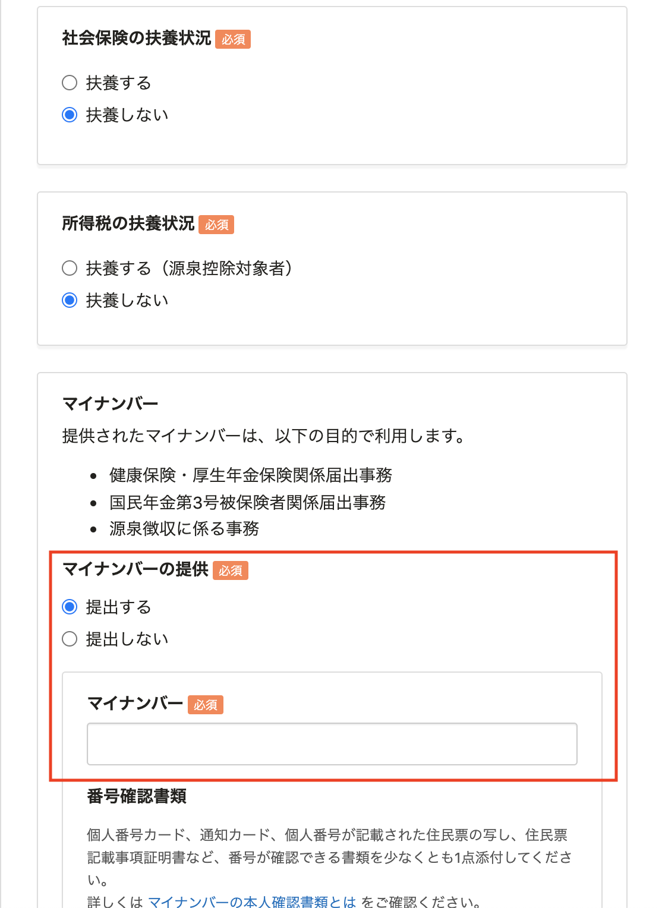
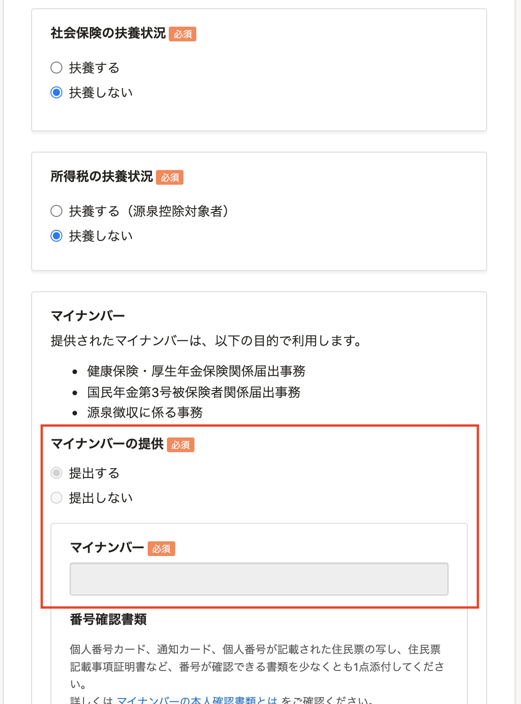
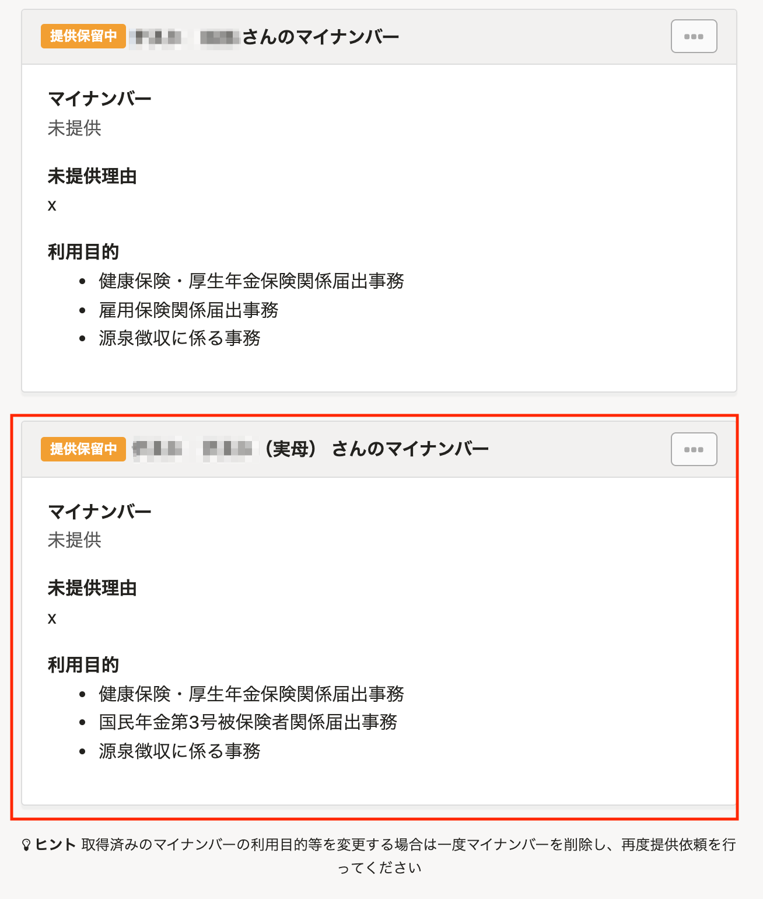
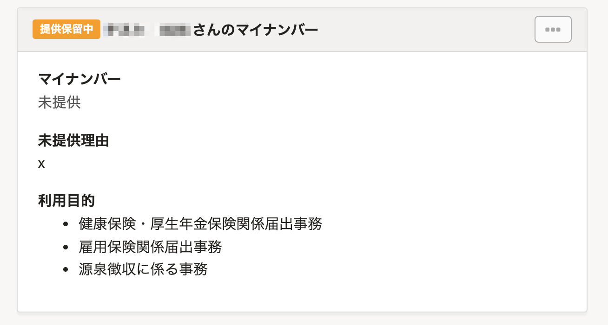

2021年12月6日（月）に行なったアップデートの詳細をお知らせします。

SmartHR基本機能の変更点は、改善2件・不具合修正1件でした。

# 📈 改善

## 扶養しない家族のマイナンバーを提出できないようにしました

入社の手続き・扶養追加の手続きをする際に、家族情報の社会保険と所得税の両方の扶養状況を **［扶養しない］** と選択した場合、 **［マイナンバー］** 項目を入力できないようにしました。

社会保険と所得税のどちらも扶養しない場合、マイナンバーを提出する必要がないためです。

| 変更前 | 変更後 |
| --- | --- |
|  |  |

あわせて、マイナンバーの提供を **［提出しない］** と選択した場合、マイナンバー管理画面からマイナンバー詳細画面を開いた際に、扶養しない家族のマイナンバー項目を非表示にしました。

| 変更前 | 変更後 |
| --- | --- |
|  |  |

## マルチログインアカウントの招待を取り消す際に、すでに存在しないアカウントが従業員情報に紐づいている場合は、従業員情報との紐づきも解除するようにしました

マルチログインアカウントの招待とは、他の企業アカウントにも登録のある従業員アカウントに招待を送ることです。

これまでは、マルチログインアカウントに対して招待を送ったあとに、その従業員アカウントが元々所属する企業アカウントが削除された場合、従業員はアカウントの設定ができず、管理者から再招待することもできなくなっていました。

これは、存在しないアカウントと従業員情報が紐づいているためです。

このような事象を回避するために、マルチログインアカウントの招待を取り消す際に、従業員情報とアカウントの紐づきも解除するようにしました。

:::related
[マルチログインアカウントとは](https://knowledge.smarthr.jp/hc/ja/articles/360026262853)
:::

# 👨‍⚕️ 不具合修正

給与明細のPDFファイルをダウンロードした際の文字表記に関する1件の不具合修正を行ないました。
