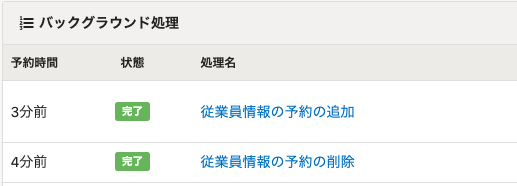
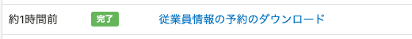
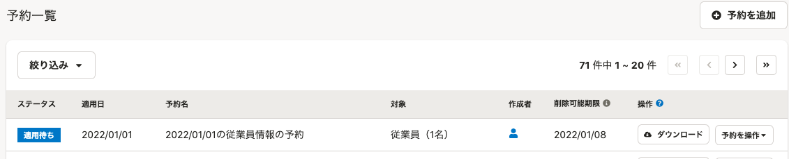

2021年12月07日（火）に行なったアップデートの詳細をお知らせします。

SmartHR基本機能の変更点は、改善1件でした。

# 📈 改善

## 予約管理機能の文言を変更しました

今後リリース予定の部署マスターの予約と区別するため、予約管理機能の文言を下記のとおり変更しました。

**従業員の予約の追加後表示されるフラッシュメッセージ**

変更前：ファイルの取り込みを受け付けました

変更後：従業員情報のファイルの取り込みを受け付けました。

**従業員情報の予約の追加・削除のバックグラウンド処理名**

変更前：予約の追加・予約の削除

変更後：従業員情報の予約の追加・従業員情報の予約の削除

**従業員情報の予約のダウンロードのバックグラウンド処理名**

変更前：予約のダウンロード

変更後：従業員情報の予約のダウンロード

**従業員情報の予約を追加する際に、［予約名］が空の場合の名前**

変更前：｛適用日｝の予約

変更後：｛適用日｝の従業員情報の予約

