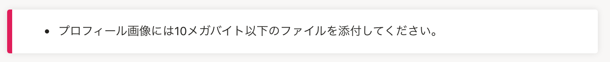
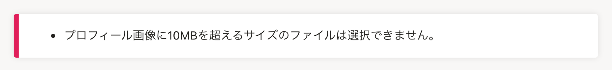

2021年12月08日（水）に行なったアップデートの詳細をお知らせします。

SmartHR基本機能の変更点は、改善1件でした。

# 📈 改善

## 取り込むファイルのサイズが大きすぎる場合のエラーメッセージを改善しました

招待フォームや従業員編集画面などでファイルを取り込む際に、選択したファイルのサイズが大きすぎる場合のエラーメッセージの内容を変更しました。

SmartHR全体の表記ルールにあわせた対応です。

**変更前**

**変更後**

