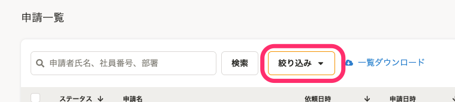
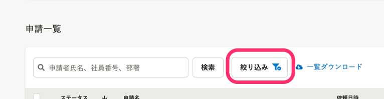

2021年12月13日（月）に行なったアップデートの詳細をお知らせします。

SmartHR基本機能の変更点は、改善2件・不具合修正2件でした。

# 📈 改善

## 招待フォームでファイルを添付する際の内部動作を改善しました

これまでは、従業員招待フォームでファイルを添付する際、高画質な画像の添付で時間がかることがありました。

今回のリリースで、従業員招待フォームの口座情報・家族情報・カスタム項目でファイルを添付する際の内部動作を見直し、速度を改善しました。

## 申請一覧の絞り込み条件を保持するようにしました

申請の承認・差し戻しをした際や、別画面から申請一覧画面に戻った場合でも、設定した絞り込み条件を保持するようにしました。

画面を移動しても絞り込み条件が保持されるため、連続して承認などの操作をしやすくしました。

あわせて、絞り込み中のボタンの表示を変更し、絞り込み中であることをわかりやすくしました。

| 変更前 |  |
| --- | --- |
| 変更後 |  |

# 👨‍⚕️ 不具合修正

従業員情報を編集した際の挙動に関する修正など、2件の不具合修正を行ないました。
