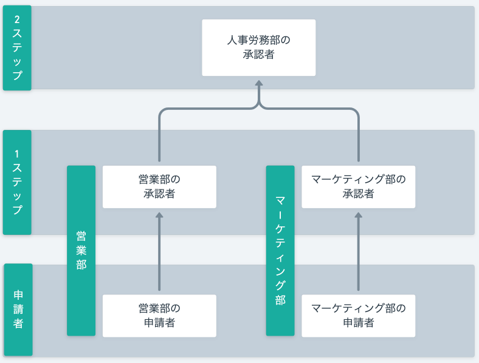
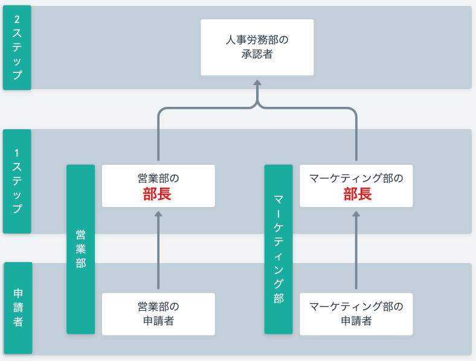
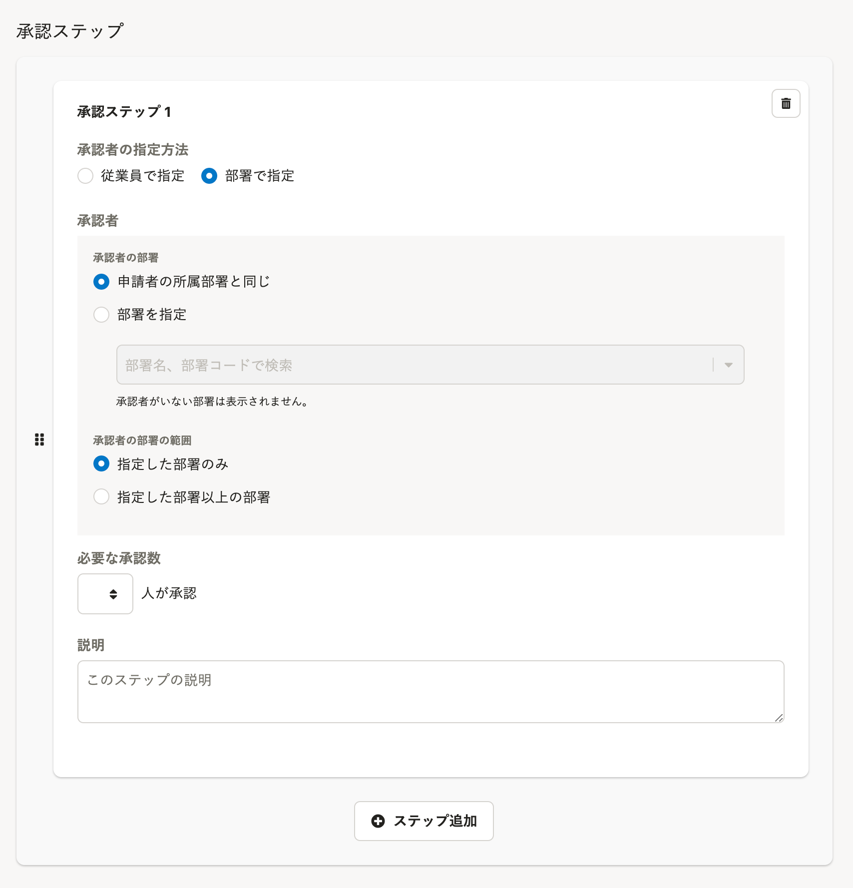
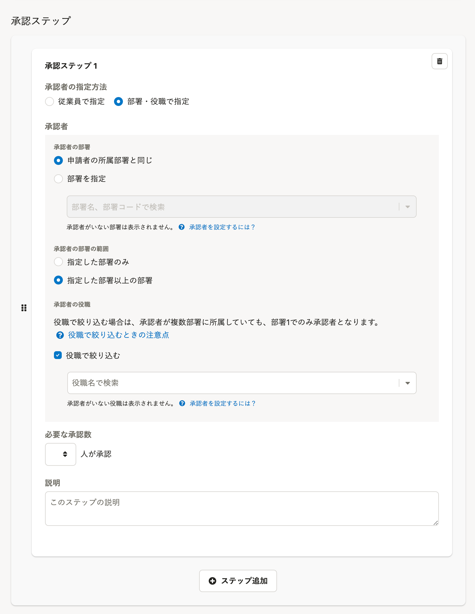

2021年12月14日（火）に行なったアップデートの詳細をお知らせします。

SmartHR基本機能の変更点は、新機能1件・不具合修正1件でした。

# ✨ 新機能

## 承認者を部署と役職で指定して承認経路を作成できるようにしました

これまでの申請機能は、承認者を部署で指定できましたが、指定した部署に含まれる承認権限をもつすべての従業員が承認できる仕様でした。

今回のアップデートにより、指定した部署内で役職を持った従業員に承認者を絞れるようにしました。

[【申請】承認者を部署と役職で指定して承認経路を作成できるようになりました（12/14更新）](https://smarthr.jp/update/30593)

| 部署で指定 | 部署と役職で指定 |
| --- | --- |
|  |  |

共通設定の **［申請］>［経路］** の画面から設定できます。

承認者の指定方法の **［部署・役職で指定］** を選択し、 **［承認者の部署］** を設定すると、指定した部署の中から、役職で承認者を絞り込めるようになります。

| 変更前 | 変更後 |
| --- | --- |
|  |  |

役職で絞る場合の注意点として、承認者が複数の部署に所属していても、従業員情報の「部署1」に設定されている役職のみが表示されます。

詳しい機能の説明と操作上の注意点は、下記のページを参照してください。

[承認者を部署と役職で指定する](https://knowledge.smarthr.jp/hc/ja/articles/360061287294)

[Q. 承認経路で承認者を役職で絞り込むときの注意点は？](https://knowledge.smarthr.jp/hc/ja/articles/4407278215833)

[Q. 承認経路の設定で指定したい部署や役職が表示されない場合は？](https://knowledge.smarthr.jp/hc/ja/articles/4407135967001)

# 👨‍⚕️ 不具合修正

モバイル画面の表示に関する1件の不具合修正を行ないました。
