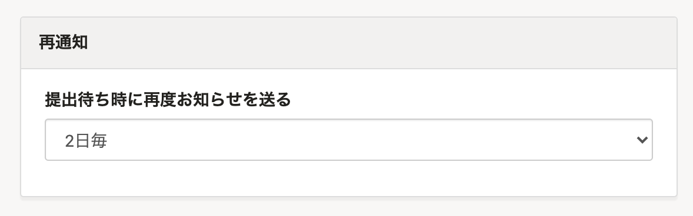
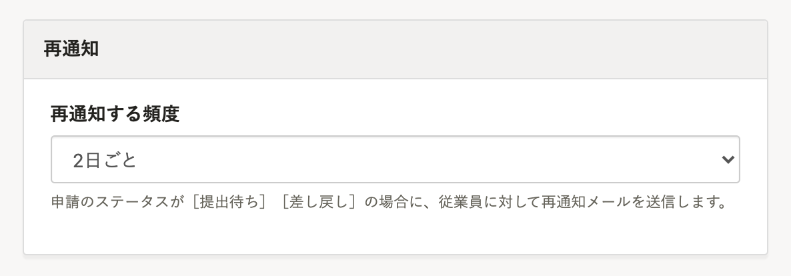

2021年12月15日（水）に行なったアップデートの詳細をお知らせします。

SmartHR基本機能の変更点は、改善1件・不具合修正1件でした。

# 📈 改善

## 申請のステータスが［差し戻し］の場合にも再通知メールを送信できるようにしました

これまでは、申請のステータスが **［提出待ち］** の場合のみ再通知メールの送信を設定できました。

今回のリリースにより、 **［差し戻し］** の場合にも再通知メールを送信できるようにし、提出を促せるようにしました。

| 変更前 | 変更後 |
| --- | --- |
|  |  |

# 👨‍⚕️ 不具合修正

経路設定で承認者を追加する際の挙動に関する1件の不具合修正を行ないました。
