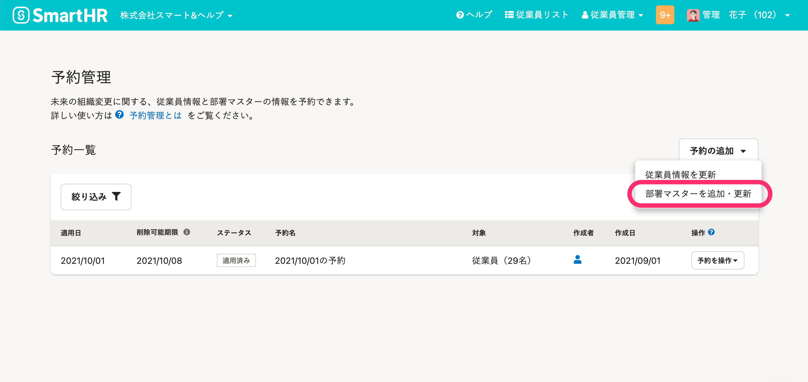
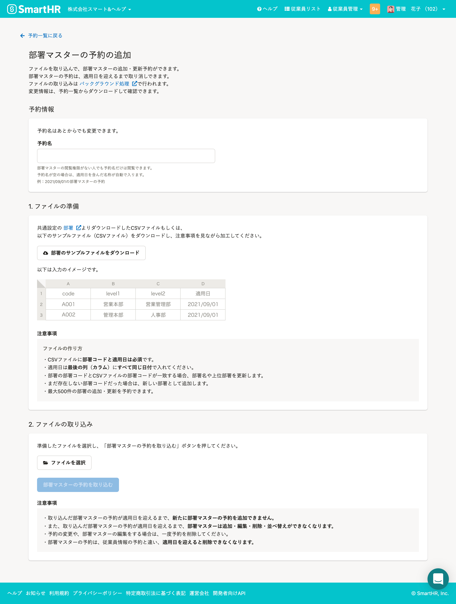

2021年12月16日（木）に行なったアップデートの詳細をお知らせします。

SmartHR基本機能の変更点は、新機能1件でした。

# ✨ 新機能

## 予約管理機能が部署マスターの追加・変更に対応しました

これまで予約管理機能は従業員情報の更新のみ対応していましたが、今回のアップデートにより、部署マスターも未来の適用日で一括で追加・更新できるようにしました。

この機能により、部署の構造や名称の変更が起こるような組織改変においても、事前に予約できます。

詳しくは、下記のお知らせをご覧ください。

[【予約管理機能】部署マスターの追加・変更を予約できるようになりました](https://smarthr.jp/update/30780)

 **［従業員管理］>［予約管理］>［予約の追加］** より部署マスターの予約の追加ができます。

 **［部署マスターの予約の追加］** 画面

さらに詳しい使い方は、下記のヘルプページをご確認ください。

:::related
[予約管理機能とは](https://knowledge.smarthr.jp/hc/ja/articles/4403483379097)
[予約を追加する](https://knowledge.smarthr.jp/hc/ja/articles/4403491370521)
[予約の内容を確認する](https://knowledge.smarthr.jp/hc/ja/articles/4403483367577)
[予約を削除する](https://knowledge.smarthr.jp/hc/ja/articles/4403491360025)
[適用済みの予約の削除で削除される情報](https://knowledge.smarthr.jp/hc/ja/articles/4402938690841)
:::
