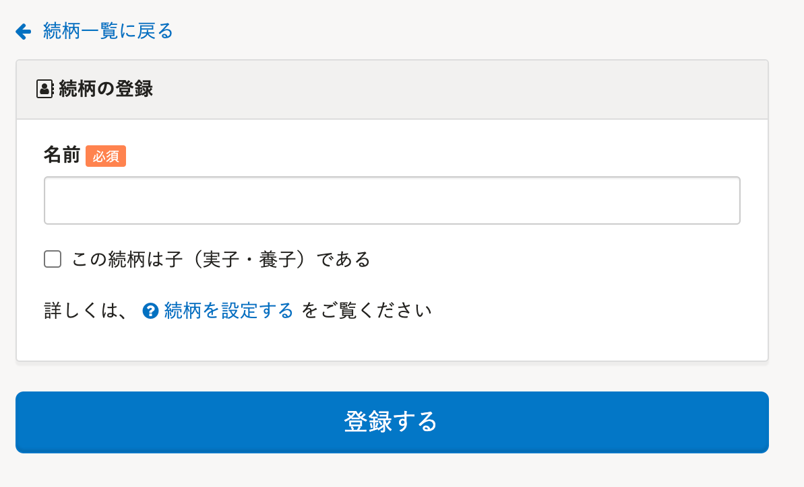

2022年1月4日（火）に行なったアップデートの詳細をお知らせします。

SmartHR基本機能の変更点は、改善5件・不具合修正4件でした。

# 📈 改善

## ダウンロード項目を新規追加する際の初期状態を変更しました

カスタムダウンロードフォーマットのダウンロード項目を新規追加する際の **［項目値］** の初期選択を、 **［参照しない］** から **［従業員／家族項目を参照する］** にしました。

ダウンロード項目を追加するとき、 **［固定値］** よりも **［SmartHRの項目］** を選択する場合が多いことを考慮した改善です。

| 変更前 | 変更後 |
| --- | --- |
|  |  |

## モバイル画面のお問い合せアイコン位置を変更しました

これまでは、モバイル画面のお問い合わせアイコンが操作ボタンと重なって表示されることがあり、操作しづらいという声をいただいておりました。

今回のリリースで、アイコンを画面上部に移動し、操作しやすくしました。

| 変更前 | 変更後 |
| --- | --- |
|  |  |

:::related
[スマートフォンでご利用時のお問い合わせアイコンの表示位置を変更しました。｜SmartHR](https://smarthr.jp/news/31776)
:::

## 続柄が子である場合、被扶養者（異動）届の続柄に反映させるようにしました

これまでは、協会けんぽ、東京都情報サービス産業健保、その他の健保で「健康保険 被扶養者（異動）届・国民年金第3号被保険者関係届」を作成した際、家族情報の続柄で **［この続柄は子である］** にチェックを入れた場合でも書類上に反映されていませんでした。

今回の改修により、 **［この続柄は子である］** にチェックが入っている場合、書類の **［④続柄］** 項目で **［1.実子・養子］** に丸が付くようにしました。

また、書類も最新版に対応しました。

あわせて、続柄の登録・編集画面のチェックボックスの文言を **［この続柄は子である］** から、 **［この続柄は子（実子・養子）である］** に変更しました。

| 変更前 | 変更後 |
| --- | --- |
|  |  |

:::related
[【一覧】家族情報の \[続柄\] と、健康保険 被扶養者（異動）届の「④続柄」の対応表](https://knowledge.smarthr.jp/hc/ja/articles/360026641593)
:::

## 予約をした際の、インフォメーションパネルのアイコンをほかのデザインに合わせました

予約をした際の予約管理画面と、部署マスター画面のインフォメーションパネルに表示されるアイコンを、SmartHR全体のデザインに合わせたものに変更しました。

| 変更前 | 変更後 |
| --- | --- |
|  |  |

## トップページの表示速度を改善しました

トップページの表示が遅くなることがあったため、表示速度を改善しました。

# 👨‍⚕️ 不具合修正

部署マスターの予約に関する修正など、4件の不具合修正を行ないました。
