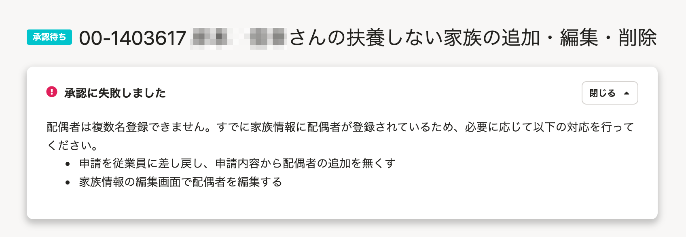

2022年1月5日（水）に行なったアップデートの詳細をお知らせします。

SmartHR基本機能の変更点は、改善1件でした。

# 📈 改善

## 配偶者情報が重複した際に表示するエラーメッセージをわかりやすくしました

従業員が配偶者情報を登録する申請を提出したあと、別の手段で配偶者情報を登録し、そのあとに提出された申請を承認しようとすると、配偶者情報が重複してエラーになります。

これまでは、配偶者情報の重複があった場合のエラーメッセージがわかりにくいものでしたが、今回の改修により、下図のように対応方法を含んだエラーメッセージを表示するようにしました。

