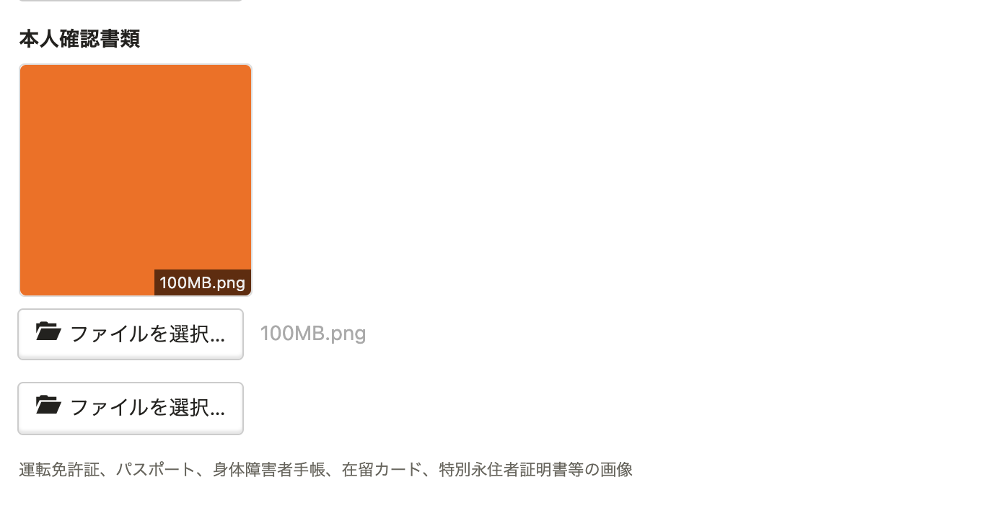
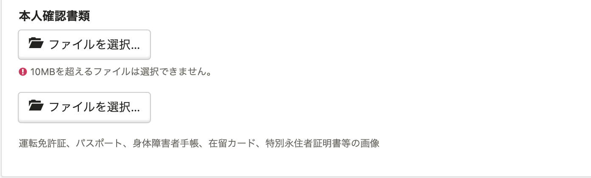

2022年1月7日（金）に行なったアップデートの詳細をお知らせします。

SmartHR基本機能の変更点は、改善1件・不具合修正2件でした。

# 📈 改善

## 取り込むファイルのサイズが大きすぎる場合、添付直後にエラーメッセージを表示するようにしました

これまでは、招待フォームや従業員編集画面などに添付するファイルが規定のサイズを超えている場合、 **［確認］** をクリックしたあとにエラーメッセージが表示されていました。

今回の改修により、添付直後にメッセージを表示するようにし、エラーをわかりやすくしました。

個別アップロード画面

| 変更前 | 変更後 |
| --- | --- |
|  |  |

一括アップロード画面

| 変更前 | 変更後 |
| --- | --- |
|  |  |

# 👨‍⚕️ 不具合修正

「健康保険 被扶養者（異動）届」の最新様式への対応に関する修正など、2件の不具合修正を行ないました。
