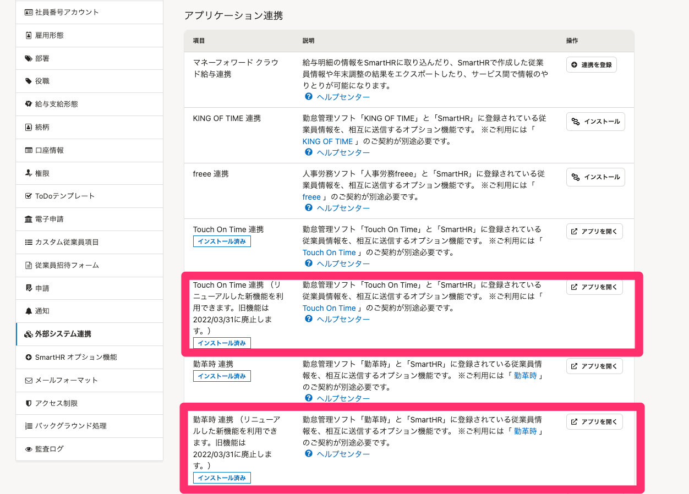
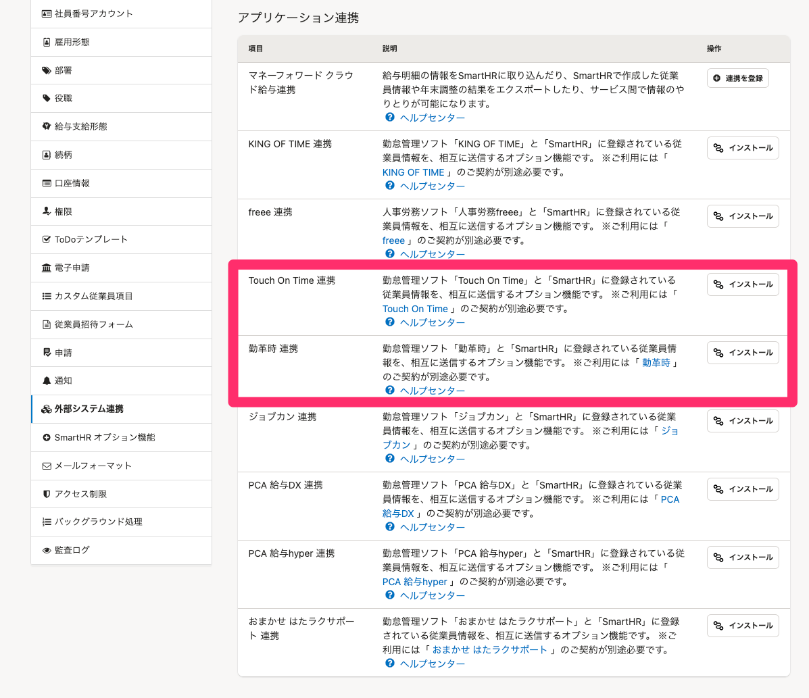

2022年1月13日（木）に行なったアップデートの詳細をお知らせします。

SmartHR基本機能の変更点は、新機能1件でした。

# ✨ 新機能

## リニューアルしたTouch On Time連携と勤革時連携を、外部システム連携メニューに追加しました

 **［共通設定］>［外部システム連携］>［アプリケーション連携］** に、リニューアルしたTouch On Time連携と勤革時連携を追加しました。

旧バージョンの連携をしていない場合は、新連携の動線のみ画面に表示されます。

詳しい連携アプリのリニューアル内容については、下記のお知らせを参照してください。

[【Touch On Time】【勤革時】連携アプリをリニューアルしました](https://smarthr.jp/update/32042)

**旧Touch On Time連携と旧勤革時連携がインストールされている場合の画面**

**旧Touch On Time連携と旧勤革時連携がインストールされていない場合の画面**

