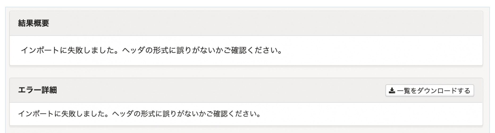
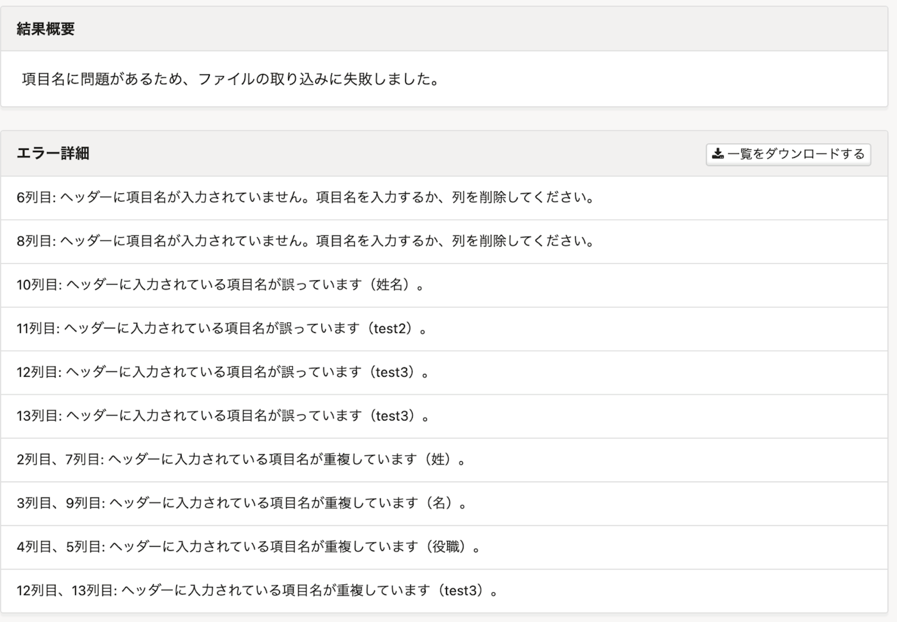

2022年1月19日（水）に行なったアップデートの詳細をお知らせします。

SmartHR基本機能の変更点は、改善1件でした。

# 📈 改善

## 従業員情報の一括登録・一括更新でエラーが起きた場合のメッセージをわかりやすくしました

従業員情報の一括登録・一括更新のファイルを取り込んだ際、ファイルのヘッダーに不備があった場合に表示されるエラーメッセージの改善です。

#### **変更前**

エラーメッセージの内容では原因を特定できず、解決するまでに時間がかかることがありました。

#### **変更後**

以下の原因でエラーになった場合、バックグラウンド処理詳細画面の **［結果概要］** と **［エラー詳細］** 欄に、原因の詳細を明示するようにしました。

- 存在しない項目名を指定した場合
- 存在する項目名だが、操作できない権限の場合（閲覧権もない場合は存在しない項目名と同じエラーを表示）
- 重複する項目名がある場合
- 空の項目名がある場合

:::related
[エラーが出たり、処理に失敗した場合は？](https://knowledge.smarthr.jp/hc/ja/articles/360033711133)
:::
