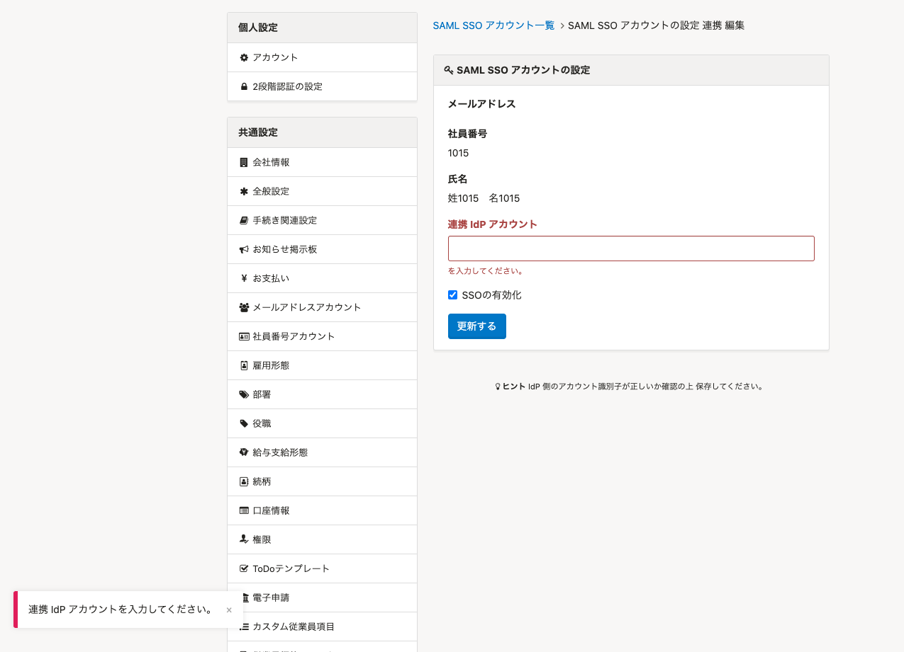

2022年1月24日（月）に行なったアップデートの詳細をお知らせします。

SmartHR基本機能の変更点は、改善1件・不具合修正1件でした。

# 📈 改善

## SAML SSOアカウントを有効化する際は連携IdPアカウントの設定を必須にしました

これまではSAML SSOアカウントの設定をする際に、 **［連携IdPアカウント］** が未入力でもSSOを有効化できる仕様でした。

その場合、SAML SSOでログインする際にエラーになりログインできませんでした。

今回の改修により、 **［連携Idpアカウント］** が未入力の状態でSSOの有効化をしようとすると、下図のようなエラーメッセージを表示するようにしました。

# 👨‍⚕️ 不具合修正

 **［部署一覧］** の並べ替えをする際のアイコン表示に関する1件の不具合修正を行ないました。
