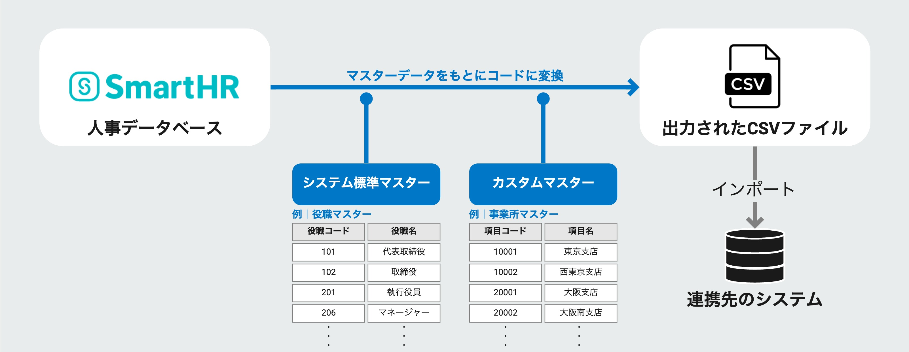
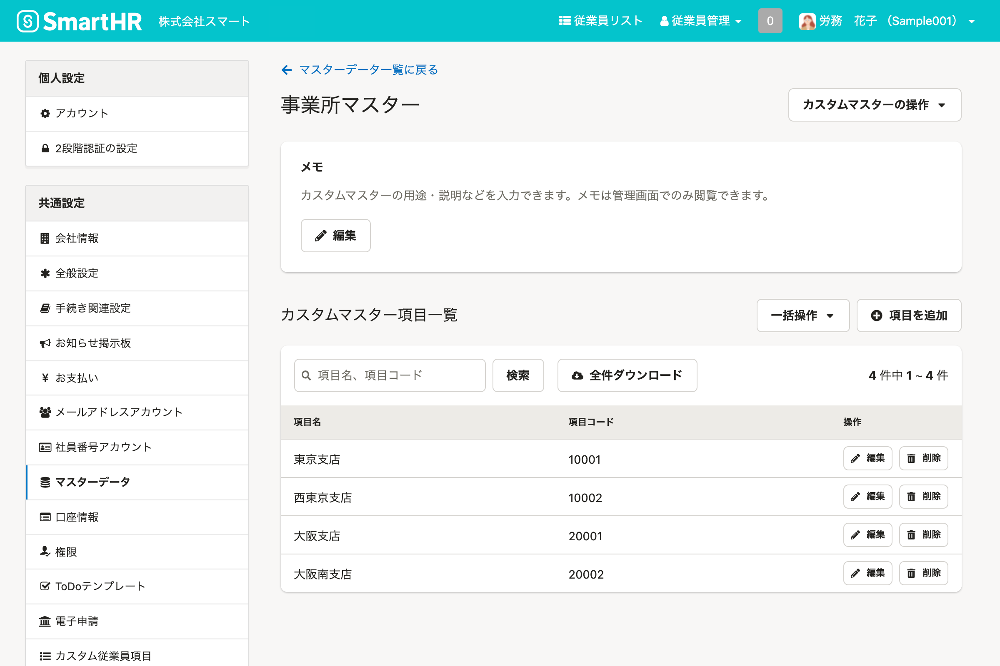
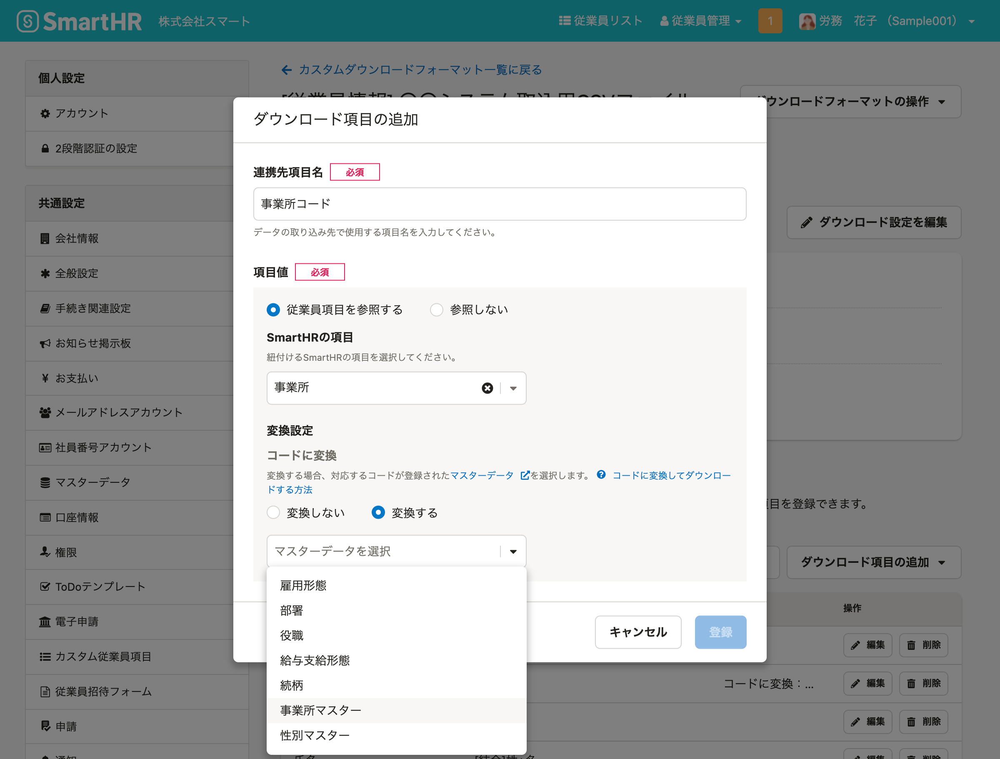

2022年1月25日（火）に行なったアップデートの詳細をお知らせします。

SmartHR基本機能の変更点は、新機能1件・不具合修正1件でした。

# ✨ 新機能

## CSV連携機能に、従業員情報・家族情報をコードに変換してダウンロードできる機能を追加しました

SmartHRに登録された従業員情報・家族情報を外部システムへ従業員情報を取り込む際に、項目をコードに変換する手間がかかる場合がありました。

この手間を解消するため、 **［システム標準マスター］** や **［カスタムマスター］** をもとに、項目を任意のコードに変換してCSVファイルへ出力できるようにしました。

:::related
[【CSV連携】値をコードに変換して出力できるようになります](https://smarthr.jp/update/32200)
:::

### 1\. ［システム標準マスター］や［カスタムマスター］でコードを登録する

 **［共通設定］>［マスターデータ］** から、マスターデータのコードを登録します。

:::related
[マスターデータの管理とは](https://knowledge.smarthr.jp/hc/ja/articles/4408180124953)
:::

### 2\. ［共通設定］＞［外部システム連携］＞［カスタムダウンロードフォーマット］から、コードへ変換設定

ダウンロード項目を追加・編集する際に選択した **［SmartHRの項目］** が変換可能な項目の場合、変換設定が表示されます。

 **［変換する］** を選択すると、対応するコードを登録したマスターデータを選択できます。

:::related
[従業員情報・家族情報の項目を、コードに変換してダウンロードするには？](https://knowledge.smarthr.jp/hc/ja/articles/4407091112345)
[カスタム項目をコードに変換して、従業員情報をダウンロードするには？](https://knowledge.smarthr.jp/hc/ja/articles/4410660698649)
:::

# 👨‍⚕️ 不具合修正

特定条件下でマイナンバー提供依頼する際の挙動に関する1件の不具合修正を行ないました。
