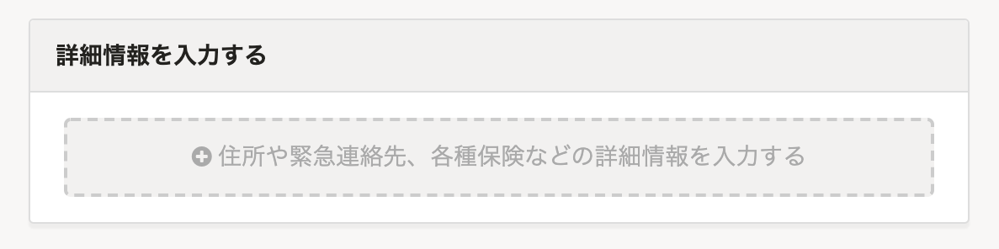
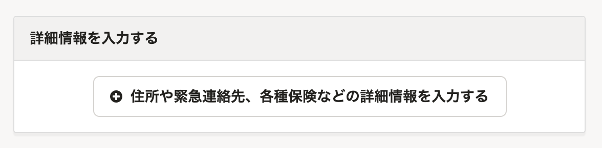
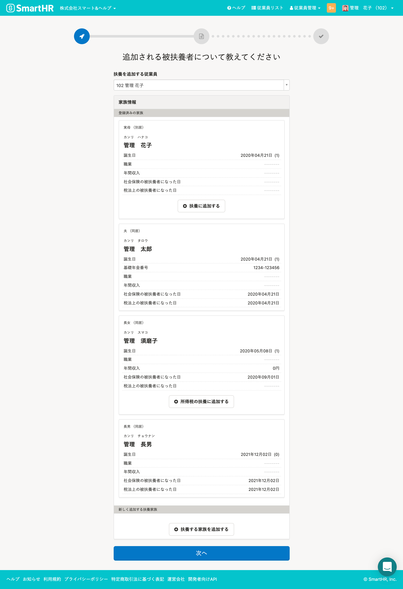
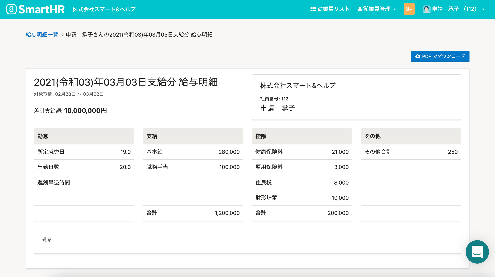
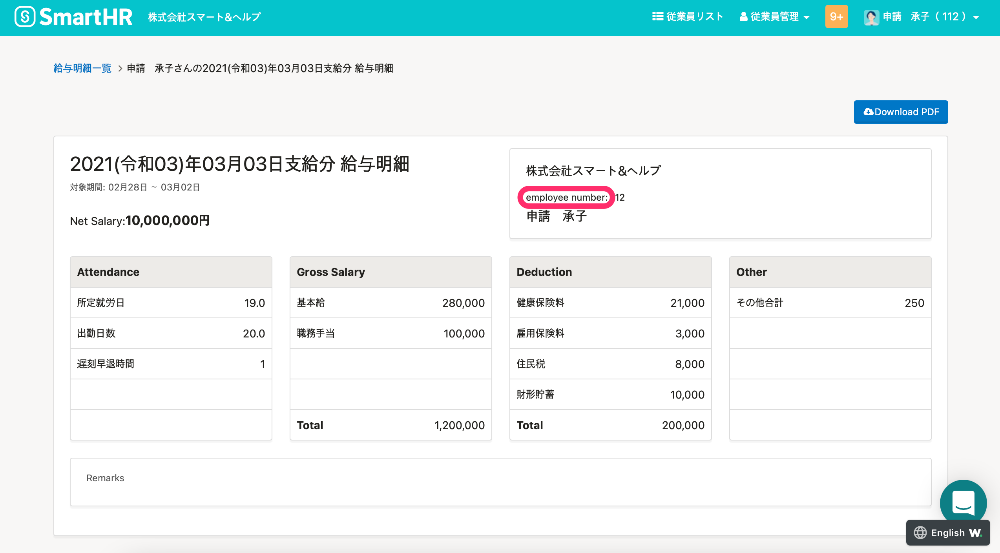

2022年1月26日（水）に行なったアップデートの詳細をお知らせします。

SmartHR基本機能の変更点は、新機能1件・アクセシビリティ1件でした。

# 📈 改善

## フォーム追加ボタンの視認性を向上させました

これまでは、扶養追加手続き画面などに表示されるフォームの追加ボタンが薄いグレーだったため、操作時に気づかないケースがありました。

今回のリリースにより、ボタンの形状を改善し文字色も濃くすることで、視認性を高めました。

該当画面は、以下のとおりです。

- 扶養追加手続き画面
- 入社手続き画面
- 育児休業給付金申請の手続き
- 従業員情報編集画面
- 新規電子申請依頼画面
- 電子申請情報の編集画面

| 変更前 | 変更後 |
| --- | --- |
|  |  |
|  |  |

# 🎢 アクセシビリティ

## 給与明細の［社員番号：］を多言語対応しました

給与明細詳細画面の **［社員番号：］** を多言語対応しました。

| 日本語 |  |
| --- | --- |
| 英語 |  |
