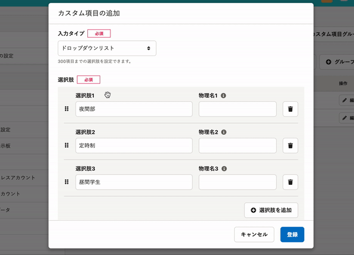
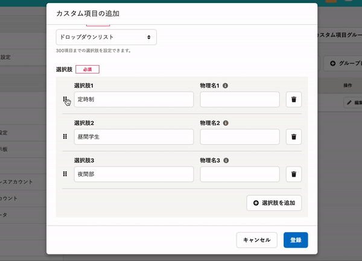
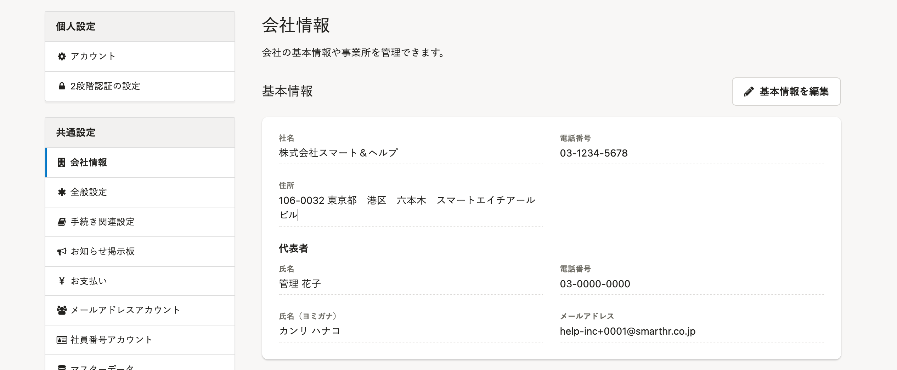
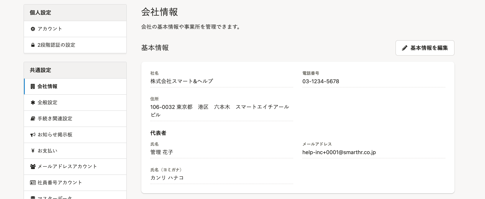
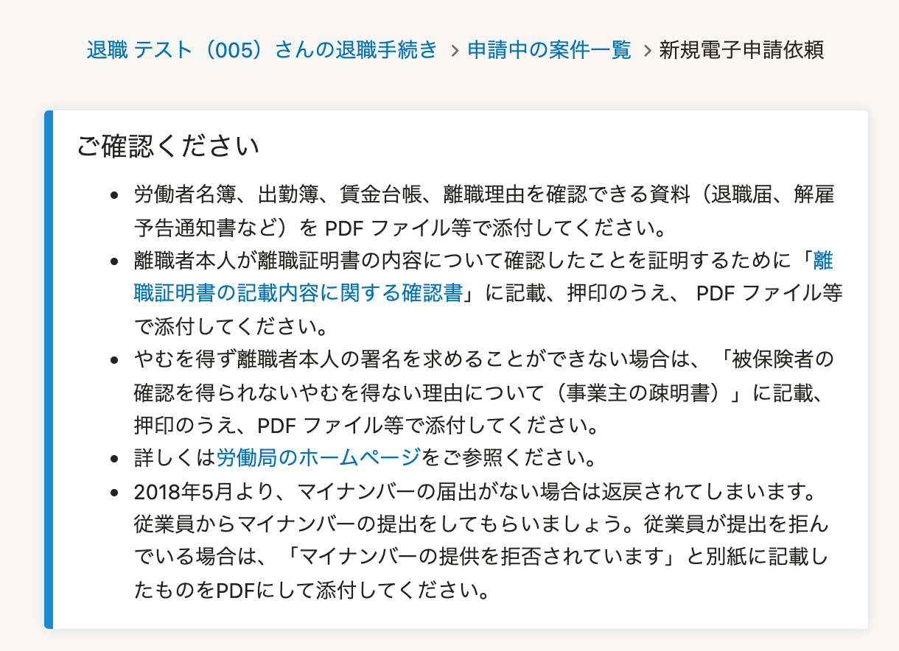
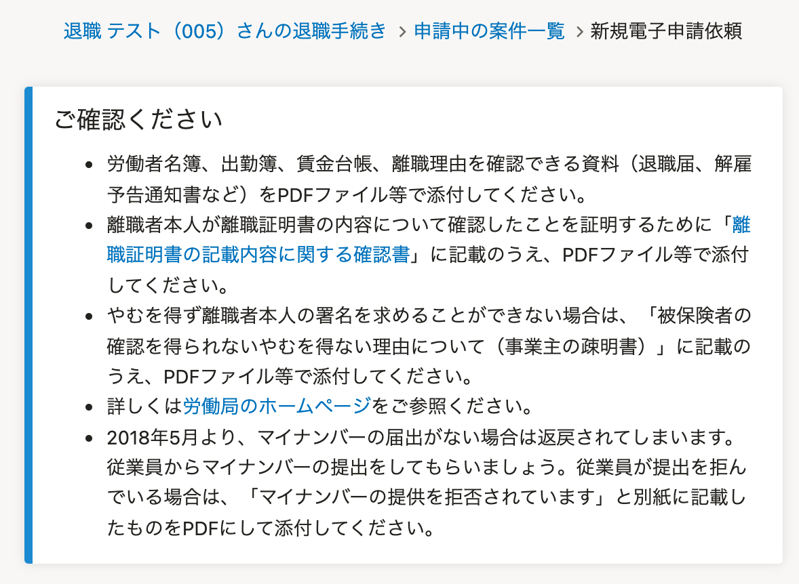

2022年1月28日（金）に行なったアップデートの詳細をお知らせします。

SmartHR基本機能の変更点は、改善3件・アクセシビリティ1件・不具合修正1件でした。

# 📈 改善

## カスタム項目の追加・編集画面でドロップダウンリストを並べ替える際の挙動を改善しました

カスタム項目の追加・編集画面でドロップダウンリストの選択肢を並べ替える際に、全体の高さが変わってしまっていたため、内部動作を見直して変わらないようにしました。

| 変更前 |   |
| --- | --- |
|  |  |

## ［会社情報］の代表者個人の電話番号を非表示にしました

これまでは、 **［共通設定］>［会社情報］** に代表者個人の電話番号が表示される仕様でしたが、会社情報欄には不要な情報のため、非表示にしました。

代表者個人の電話番号は、従業員情報で引き続き確認できます。

| 変更前 | 変更後 |
| --- | --- |
|  |  |

## 「雇用保険資格喪失届（離職票交付あり）」の電子申請依頼画面の文言を変更しました

「雇用保険資格喪失届（離職票交付あり）」の新規電子申請依頼に表示される **［ご確認ください］** の案内文を、下記のとおり変更しました。

- 2021年3月から「離職証明書の記載内容に関する確認書」への押印が不要となったため、 **［押印］** を削除
- SmartHR全体の表記にあわせて、 **［PDF］** の前後のスペースを削除

| 変更前 | 変更後 |
| --- | --- |
|  |  |

# 🎢 アクセシビリティ

## 給与明細の表示の一部を多言語対応しました

給与明細詳細画面の **［対象期間］** や **［勤怠］［支給］［合計］** などの項目名を多言語対応し、英語や中国語で表示されるようにしました。

言語を切り替える詳しい手順は、下記のヘルプページに記載しています。

:::related
[多言語化対応について](https://knowledge.smarthr.jp/hc/ja/articles/360035659594)
:::

# 👨‍⚕️ 不具合修正

「雇用保険 被保険者 離職証明書」をダウンロードした際の数字表示に関する1件の不具合修正を行ないました。
