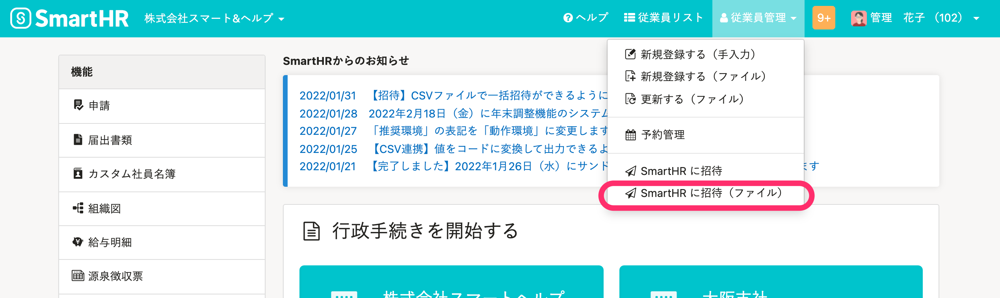
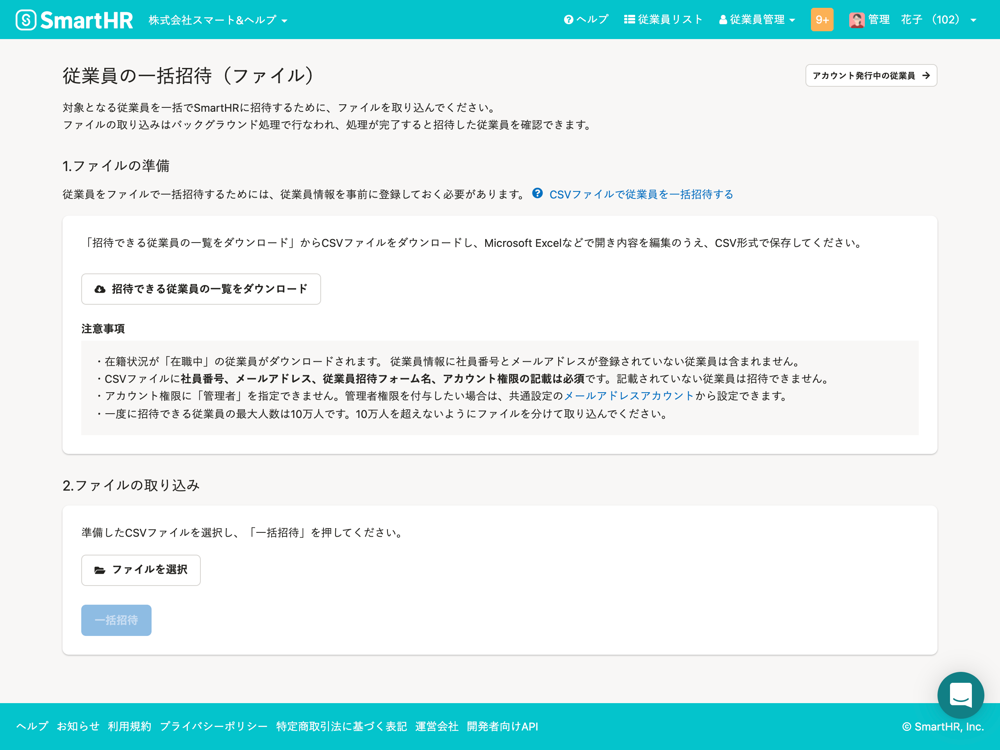
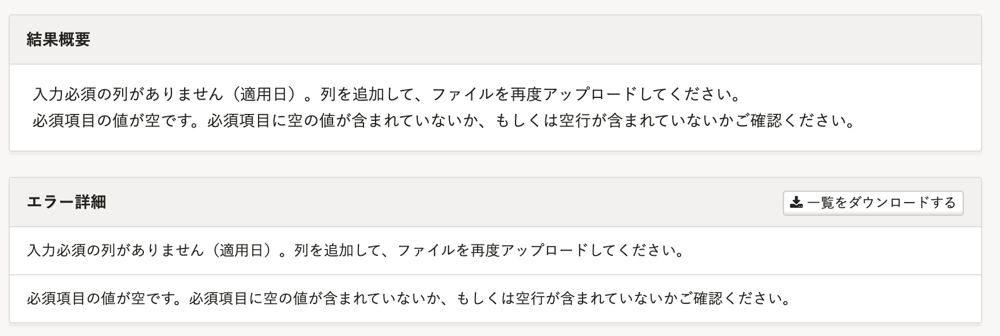
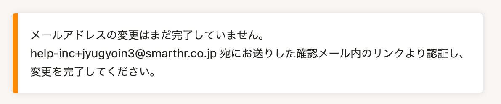
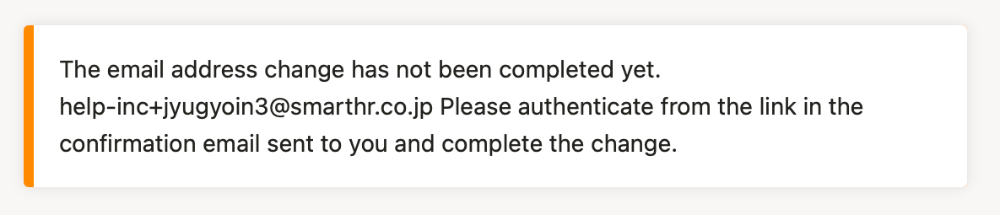
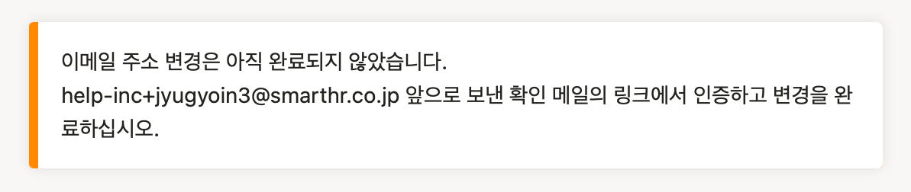

2022年1月31日（月）に行なったアップデートの詳細をお知らせします。

SmartHR基本機能の変更点は、新機能1件・改善1件・アクセシビリティ1件・不具合修正1件でした。

# ✨ 新機能

## CSVファイルで従業員を一括招待できるようにしました

これまでは、複数の従業員をSmartHRに招待する際は、同じ **［従業員招待フォーム］** や **［アカウント権限］** を指定して、一人ずつ従業員を選択する必要がありました。

今回のリリースにより、「社員番号」「氏名」「メールアドレス」「従業員招待フォーム名」「アカウント権限」を記載したCSVファイルを取り込むことで、一括で従業員を招待できるようにしました。

異なる **［従業員招待フォーム］** や **［アカウント権限］** を柔軟に組み合わせて招待できます。

:::related
[【招待】CSVファイルで一括招待ができるようになりました（1/31更新）](https://smarthr.jp/update/32258)
:::

 **［従業員管理］>［SmartHRに招待（ファイル）］** から一括招待できます。

**従業員の一括招待（ファイル）画面**

詳しい操作方法は、下記のヘルプページを参照してください。

[CSVファイルで従業員をSmartHRに一括招待する](https://knowledge.smarthr.jp/hc/ja/articles/4414946514329)

# 📈 改善

## 予約管理で従業員情報を更新する際にエラーが起きた場合のメッセージをわかりやすくしました

予約管理機能から従業員情報を更新する際、ファイルのヘッダーに不備があった場合に表示されるエラーメッセージを改善しました。

これまでは、予約管理に関するエラーメッセージのみが表示されていました。

今回のリリースにより、予約管理のエラー以外のエラーも同時に表示し、必須項目が不足している場合は具体的にどの列かを表示することで、エラーの該当箇所を確認しやすくしました。

バックグラウンド処理詳細画面の **［結果概要］** と **［エラー詳細］** 欄から確認できます。

# 🎢 アクセシビリティ

## ［アカウント］のメールアドレス設定の案内文を多言語対応しました

 **［個人設定］>［アカウント］** からメールアドレスを登録・更新する際の案内文を多言語対応しました。

| 日本語 |  |
| --- | --- |
| 英語 |  |
| 韓国語 |  |

# 👨‍⚕️ 不具合修正

申請を依頼する際と、承認者を追加する際に表示されるダイアログの挙動に関する1件の不具合修正を行ないました。
