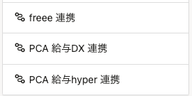
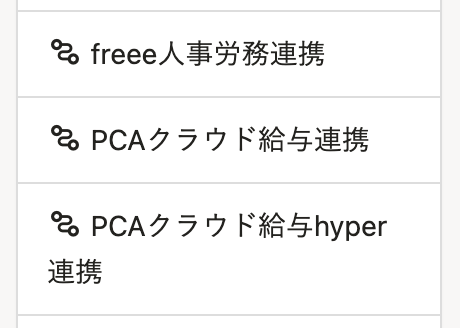
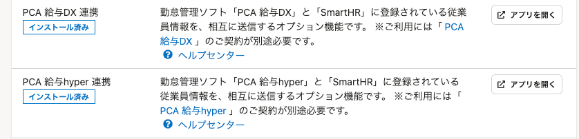
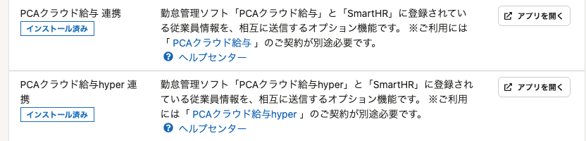
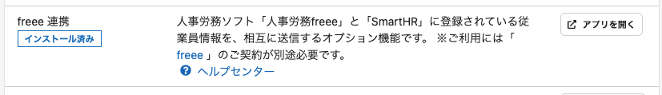
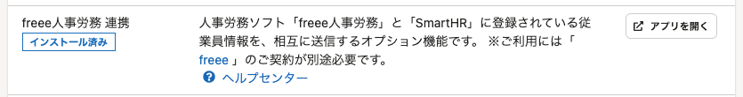

2022年2月7日（月）に行なったアップデートの詳細をお知らせします。

SmartHR基本機能の変更点は、改善1件・不具合修正1件・廃止した機能1件でした。

# 📈 改善

## 外部システムの名称変更にともない、メニュー名を変更しました

下記の外部システムの名称が変更されているため、メニュー名を変更しました。

- 「人事労務freee」→「freee人事労務」
- 「PCA 給与DX」→「PCAクラウド給与」
- 「PCA 給与hyper」→「PCAクラウド給与hyper」

#### トップページの **［機能］** 欄

| 変更前 | 変更後 |
| --- | --- |
|  |   ####    |

####  **［共通設定］>［外部システム連携］** 管理画面

| 変更前 | 変更後 |
| --- | --- |
|  |  |
|  |  |

# 👋 廃止した機能

## スモールプラン・￥0プランで「扶養しない家族の追加・編集・削除」の申請機能を廃止しました

これまでは、スモールプラン・¥0プランで「扶養しない家族の追加・編集・削除」の申請機能を利用できていましたが、2022年2月7日（月）をもって両プランから廃止しました。

スモールプラン・0円プランでは、申請機能に関する画面にアクセスできなくなりましたので、「扶養しない家族の追加・編集・削除」をする際は、家族情報を直接編集してください。

詳しくは、下記のお知らせをご覧ください。

[【2/7更新】スモールプランと0円プランで「扶養しない家族の追加・編集・削除」の申請が利用できなくなりました](https://smarthr.jp/update/31411)

# 👨‍⚕️ 不具合修正

「健康保険被扶養者（異動）届・国民年金第3号被保険者関係届」を編集する際の画面表示に関する1件の不具合修正を行ないました。
