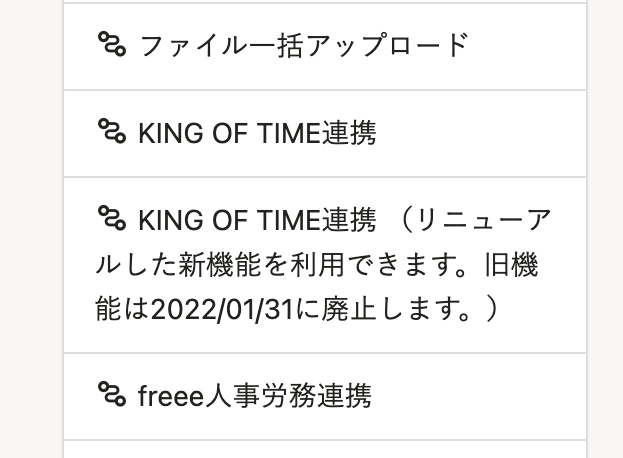
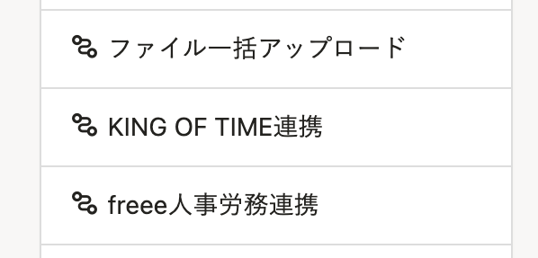
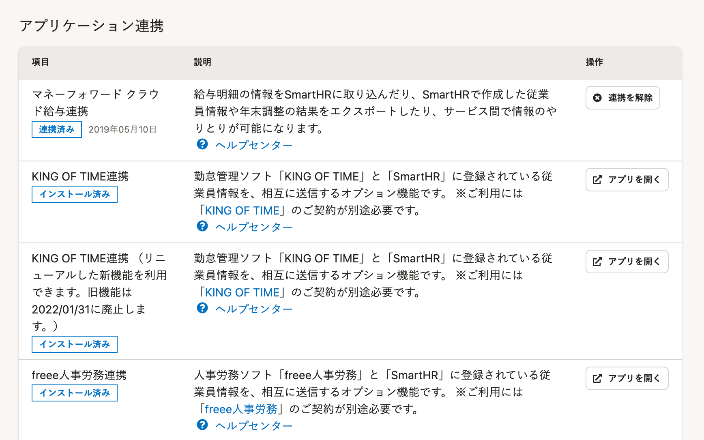
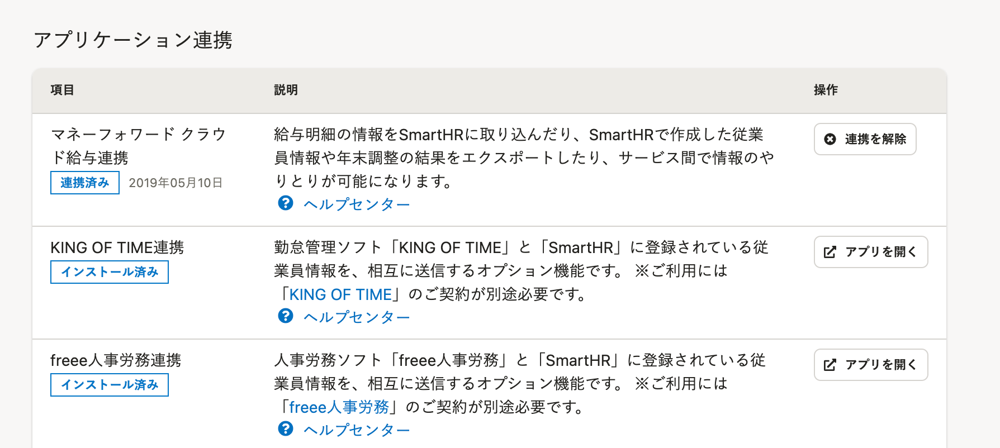

2022年2月8日（火）に行なったアップデートの詳細をお知らせします。

SmartHR基本機能の変更点は、改善1件・不具合修正2件でした。

# 📈 改善

## 旧KING OF TIME連携への動線を削除しました

2022/02/01にKING OF TIMEの旧機能を廃止したため、旧機能連携への動線を削除しました。

KING OF TIMEの旧機能をインストール済みだった場合は、トップページの **［機能］** 欄と **［外部システム連携］>［アプリケーション連携］** にメニューを表示させないようにしています。

今後はリニューアルしたKING OF TIME連携機能を利用してください。

再インストールがお済みでない場合は、以下のヘルプページを参照してください。

[他社のアプリケーションをインストールする](https://knowledge.smarthr.jp/hc/ja/articles/4405252726041)

トップページ **［機能］** 欄

| 変更前 | 変更後 |
| --- | --- |
|  |  |

 **［外部システム連携］＞［アプリケーション連携］** 

| 変更前 | 変更後 |
| --- | --- |
|  |  |

:::related
[2022/02/08【KING OF TIME】旧KING OF TIME連携画面を削除しました](https://knowledge.smarthr.jp/hc/ja/articles/4417234609817)
:::

# 👨‍⚕️ 不具合修正

 **［給与締め日］** と **［給与支給日］** の設定を特定条件にした場合の給与明細期間への影響に関する修正など、2件の不具合修正を行ないました。
