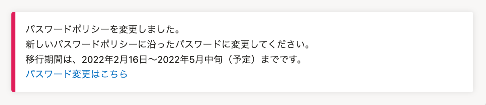
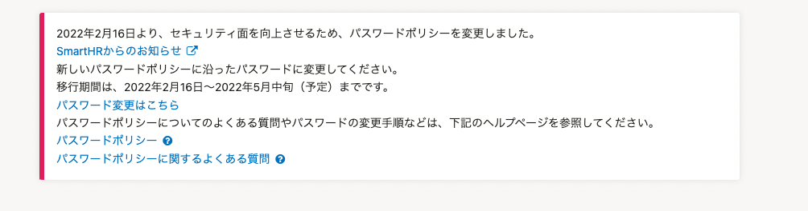

2022年2月17日（木）に行なったアップデートの詳細をお知らせします。

SmartHR基本機能の変更点は、改善1件・不具合修正1件でした。

# 📈 改善

## パスワードポリシー強化についてのパネルに、関連するリンクを設置しました

画面上部に表示しているパスワードポリシー強化についてのパネルに、関連するお知らせやヘルプページへのリンクを追加で設置しました。

[パスワードポリシー変更に伴い、パスワードの変更をお願いします](https://smarthr.jp/update/33114)

[パスワードポリシー](https://knowledge.smarthr.jp/hc/ja/articles/4415296771993)

[パスワードポリシーに関するよくある質問](https://knowledge.smarthr.jp/hc/ja/articles/4415576721177)

| 変更前 | 変更後 |
| --- | --- |
|  |  |

# 👨‍⚕️ 不具合修正

社員番号アカウントをCSVファイルで一括登録する際の挙動に関する1件の不具合修正を行ないました。
