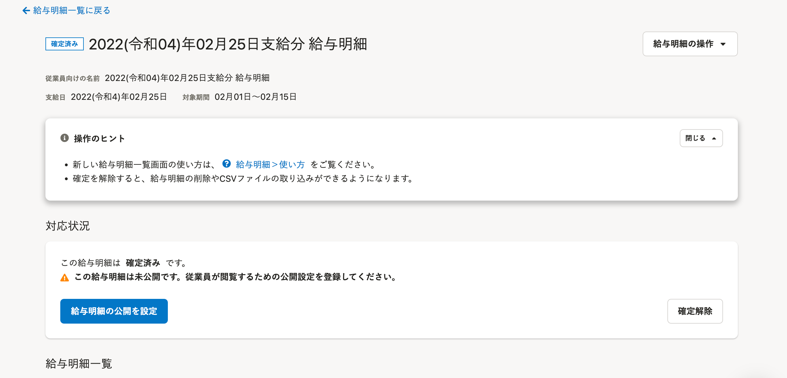
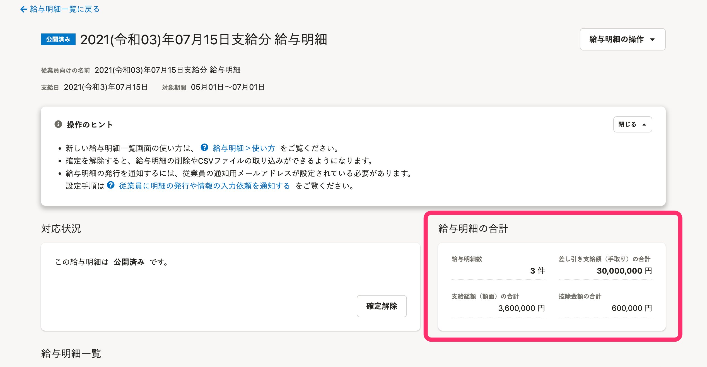

2022年2月18日（金）に行なったアップデートの詳細をお知らせします。

SmartHR基本機能の変更点は、改善1件でした。

# 📈 改善

## ［操作できる範囲］が［すべての従業員］の場合のみ、［給与明細の合計］を表示させるようにしました

これまでは給与明細の詳細画面にある **［給与明細の合計］** に、操作できる範囲に含まれない従業員の分も集計されて表示されていました。

今回のリリースで、権限設定の **［操作できる範囲］** を **［すべての従業員］** に設定している場合のみ、 **［給与明細の合計］** を表示させるようにしました。

また、 **［すべての部署］**  と **［すべての雇用形態］** の両方を設定している場合も **［すべての従業員］** と同じ設定範囲となるため、 **［給与明細の合計］** が表示されます。

|  **［すべての従業員］** に設定していない場合 |  |
| --- | --- |
|  **［すべての従業員］** に設定した場合 |  |
