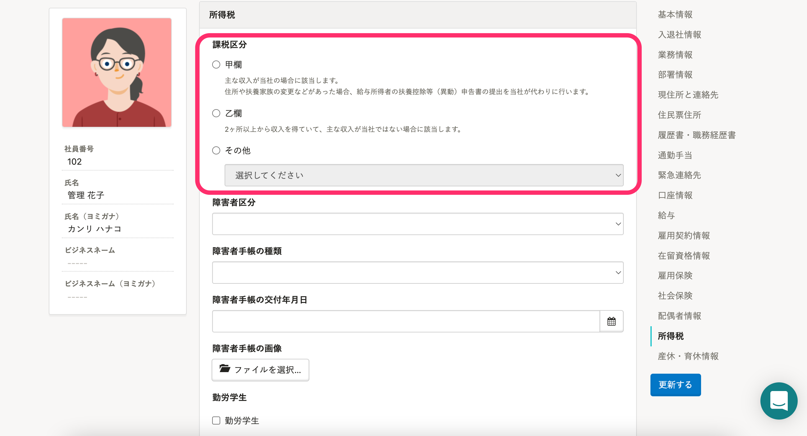
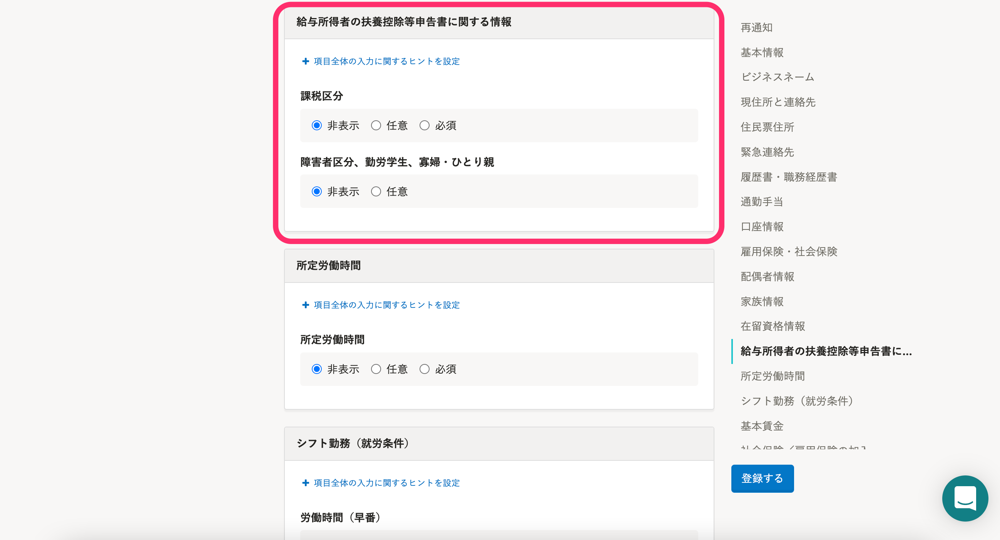

2022年2月24日（木）に行なったアップデートの詳細をお知らせします。

SmartHR基本機能の変更点は、新機能1件でした。

# ✨ 新機能

## 従業員情報のシステム標準項目に［課税区分］を追加しました

これまでは、所得税の課税区分（甲欄・乙欄等）を収集・管理するには、カスタム項目を別途作成する必要がありました。

今回のリリースにより、従業員情報の **［所得税］** 欄に **［課税区分］** をシステム標準項目として追加しました。

招待フォームや申請フォームの入力項目に設定することで、情報を収集・管理できます。

:::related
[所得税の課税区分（甲欄・乙欄）を従業員から収集できるようになりました](https://smarthr.jp/update/33147)
:::

なお、これまでどおりカスタム項目でも収集・管理できます。

すでに利用しているカスタム項目から、今回リリースしたシステム標準項目に移行したい場合は、CSVファイルやExcelファイルに書き出してから取り込む必要があります。

詳しくは、以下のヘルプページを参照してください。

[所得税の甲乙情報をカスタム従業員項目で管理する](https://knowledge.smarthr.jp/hc/ja/articles/360039754473)

### 従業員情報で［課税区分］を設定するには？

 **［課税区分］** 項目から **［甲欄］［乙欄］［その他］** を選択します。

 **［その他］** の選択肢は、 **［丙欄］［報酬］［非居住］［課税不要］** です。

### 招待フォームや申請フォームの入力項目に設定するには？

従業員招待フォームと申請フォームの **［給与所得者の扶養控除等申告書に関する情報］** 項目から設定します。

