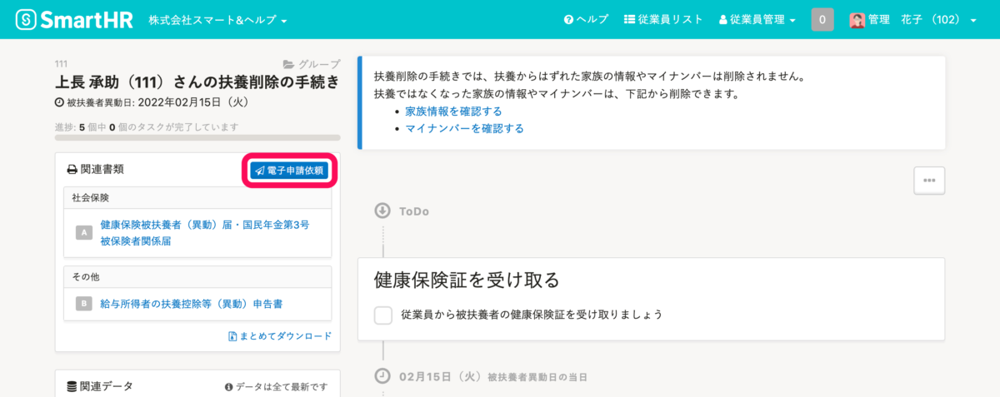

2022年2月28日（月）に行なったアップデートの詳細をお知らせします。

SmartHR基本機能の変更点は、新機能1件・不具合修正1件でした。

# ✨ 新機能

## 扶養削除の手続きの際も電子申請できるようにしました

これまでは、入社手続き・扶養追加の手続きのみ「健康保険被扶養者（異動）届・国民年金第3号被保険者関係届」の電子申請が可能でしたが、今回のリリースにより、扶養削除の手続きでも電子申請できるようにしました。

健康保険タイプは、協会けんぽのみ対応しています。

詳細は下記のお知らせを参照してください。

[扶養削除時も電子申請ができるようになりました](https://smarthr.jp/update/33096)

# 👨‍⚕️ 不具合修正

特定条件で事業所を登録した際の履歴一覧表示に関する1件の不具合修正を行ないました。
