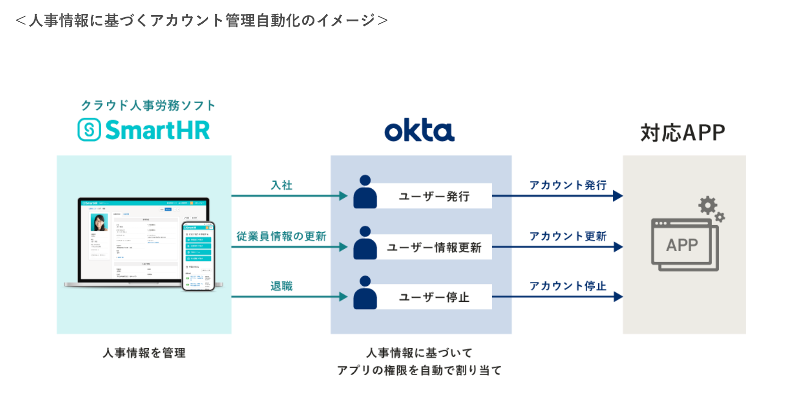
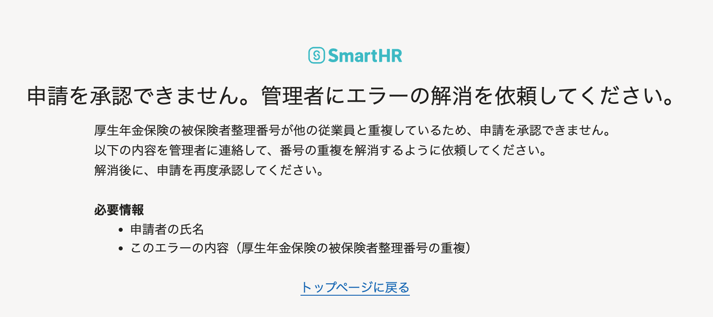

2022年3月1日（火）に行なったアップデートの詳細をお知らせします。

SmartHR基本機能の変更点は、新機能1件・改善1件でした。

# ✨ 新機能

## 「Okta Integration Network」とのSCIM連携を開始しました

Okta Japan株式会社が運営する7,300以上の事前連携アプリケーションテンプレート群「Okta Integration Network」とのSCIM連携を開始しました。

SmartHRに登録された人事情報に基づき、入社時のアカウント発行や退職時のアカウント停止を自動で行えます。

手作業によるアカウント管理が不要となることで、システム管理者の負荷や、アクセス権の更新漏れによる情報漏洩のリスクを低減します。

※ SAML/SSOの接続先がOktaの場合のみ、SCIMの設定ができます。

:::related
[クラウド人事労務ソフト「SmartHR」が、Oktaとのシステム連携により、人事情報に基づくアカウント管理の自動化を実現](https://smarthr.jp/release/33413)
:::

# 📈 改善

## 申請を提出・承認する際のエラー画面を改善しました

申請を提出・承認する際、「厚生年金保険の被保険者整理番号」が他の従業員と重複して登録されている場合に表示されるエラー画面を改善しました。

これまでは、エラーの対処を判別しづらい内容となっていたため、原因と対処を明記した内容に変更しました。

