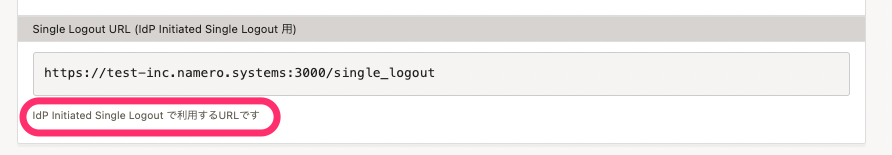

2022年3月7日（月）に行なったアップデートの詳細をお知らせします。

SmartHR基本機能の変更点は、改善1件・不具合修正2件でした。

# 📈 改善

## SAML設定のサービスプロバイダ情報に説明文を追記しました

 **［SAML SSO設定］** \> **［サービスプロバイダ情報］** 画面にある **［Single Logout URL］** の項目に、IdP Initiated Single Logoutで利用するendpointである旨の説明文を追記しました。

Single Logoutは、IdP initiatedの場合とSP initiated の場合がありますが、現在はIdP initiated Single Logoutのみの対応であることを明記しました。

# 👨‍⚕️ 不具合修正

従業員情報を一括追加・更新する際の内部動作に関する修正など、2件の不具合修正を行ないました。
