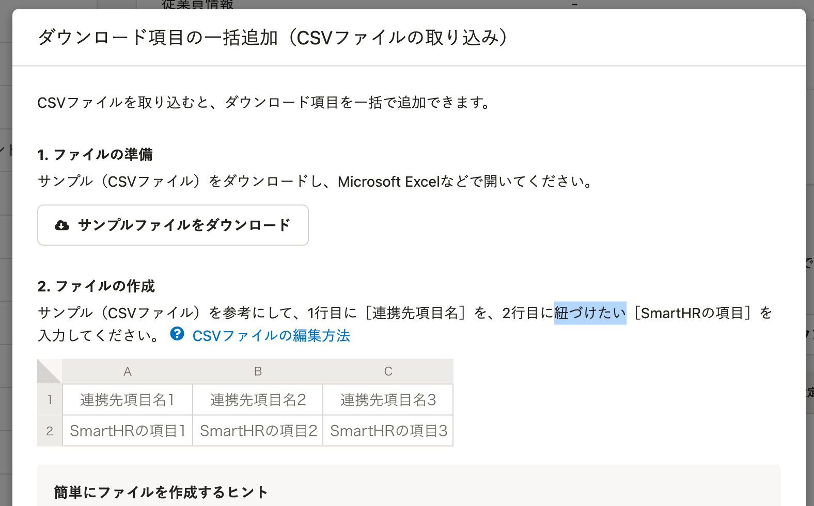

2022年3月8日（火）に行なったアップデートの詳細をお知らせします。

SmartHR基本機能の変更点は、改善4件・不具合修正1件でした。

# 📈 改善

## 申請一覧をダウンロードする際、［管理者メモ］も含めるようにしました

申請一覧の **［一覧ダウンロード］** からダウンロードしたCSVファイルに、 **［管理者メモ］** も含めるようにしました。

複数のメモがある場合は、最新のメモだけが出力されます。

:::related
[申請の管理者メモを活用する](https://knowledge.smarthr.jp/hc/ja/articles/360043330113)
:::

## 給与明細を取り込んだ際のエラーメッセージをわかりやすくしました

給与明細を取り込んだ際に、ファイルの文字コードが正しくなかったり、拡張子が「.csv」でなかったりする場合のエラーメッセージを改善しました。

これまでは、エラーの対処を判別しづらい内容となっていたため、原因と対処を明記した内容に変更しました。

## カスタムダウンロードフォーマットのダイアログ内の文言を変更しました

カスタムダウンロードフォーマット機能のダイアログ内にある文言、 **［紐付け］** を **［紐づけ］** に変更しました。

SmartHR全体の表記ルールにあわせた改善です。

例：ダウンロード項目の一括追加（CSVファイルの取り込み）ダイアログ

| 変更前 | 変更後 |
| --- | --- |
|  |  |

## メールアドレスアカウントの招待がエラーになった際のパフォーマンスを改善しました

メールアドレスアカウントの招待がエラーになった際、ページを再度読み込むまでに時間がかかることがありました。

今回の改修により内部動作を見直し、速度を改善しました。

# 👨‍⚕️ 不具合修正

予約管理機能で、従業員情報を更新した際の口座情報に関する1件の不具合修正を行ないました。
