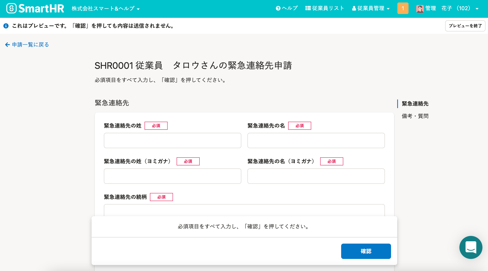

2022年3月10日（木）に行なったアップデートの詳細をお知らせします。

SmartHR基本機能の変更点は、改善1件・不具合修正2件でした。

# 📈 改善

## 申請フォームのプレビューを、実際の表示に合わせました

これまでは申請フォームのプレビューで表示されるものが、実際に申請を入力する画面とは異なる見た目をしていました。

そのため、実際の入力画面の表示に合わせました。

# 👨‍⚕️ 不具合修正

 **［住所（ヨミガナ）］** が未入力の場合の履歴表示に関する修正など、2件の不具合修正を行ないました。
