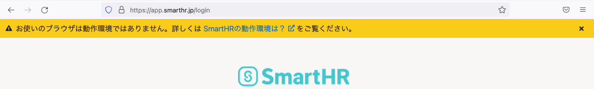
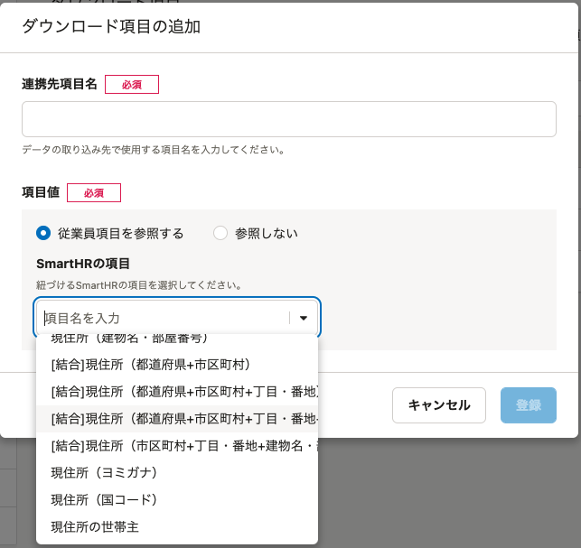
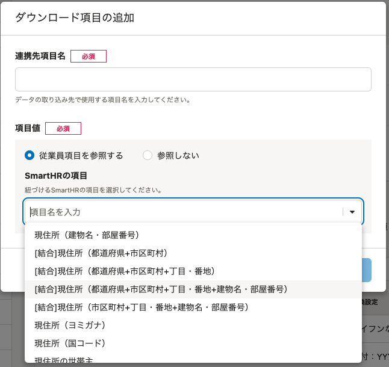
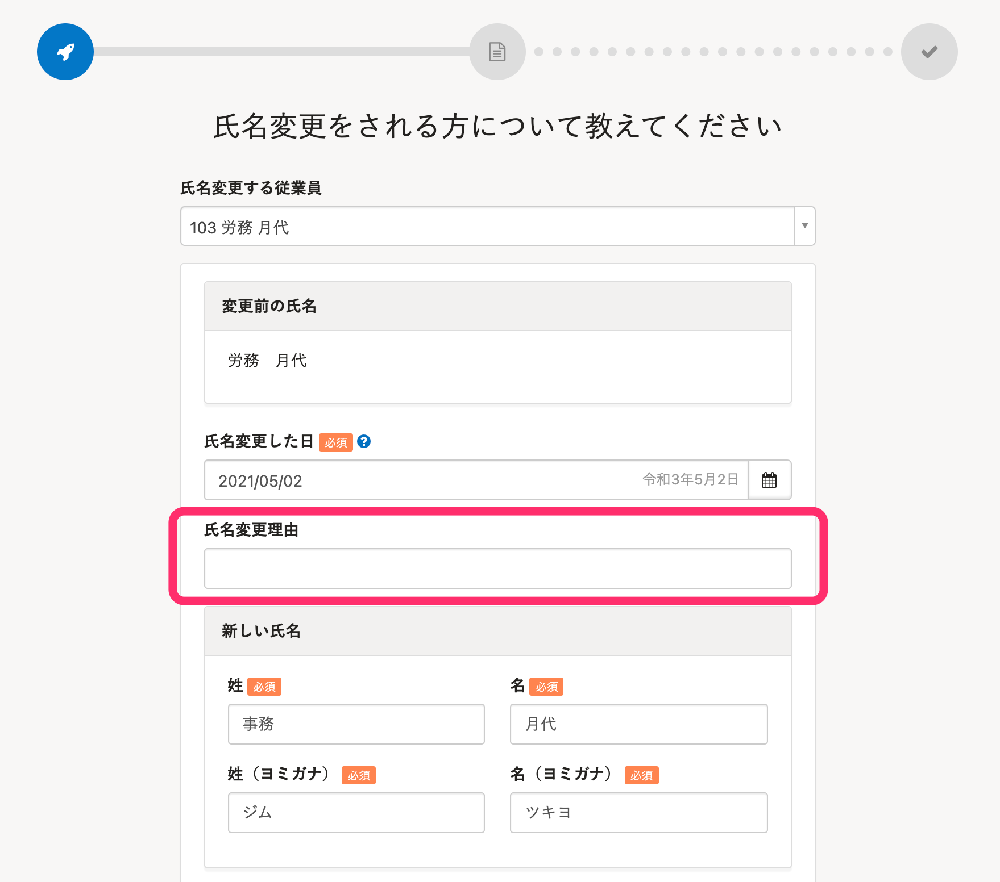
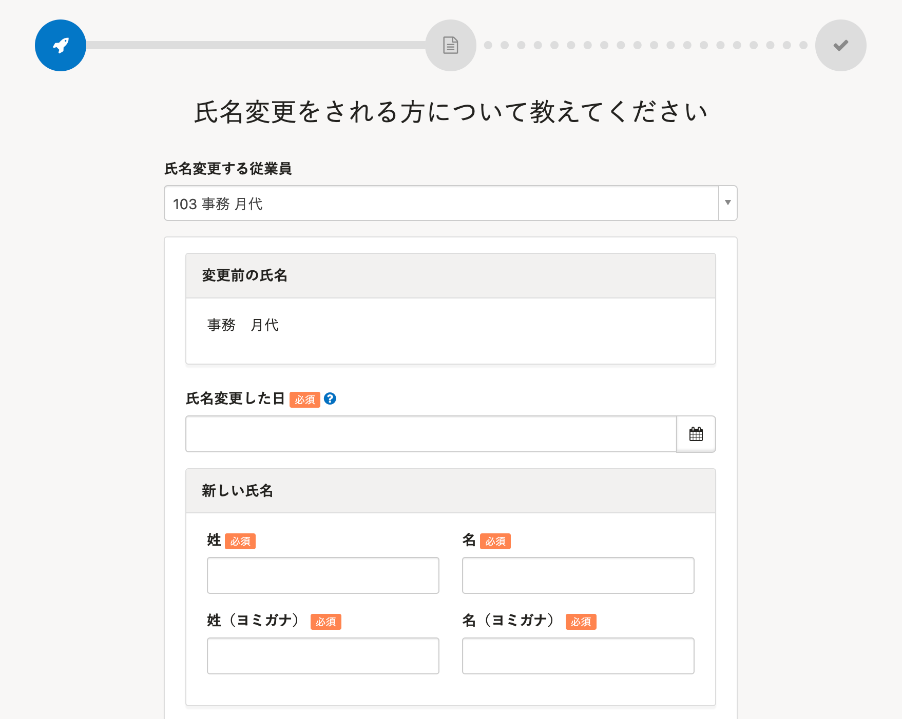

2022年3月14日（月）に行なったアップデートの詳細をお知らせします。

SmartHR基本機能の変更点は、改善3件・不具合修正1件でした。

# 📈 改善

## 動作環境以外のブラウザからアクセスした場合、画面上部にアラートメッセージを表示するようにしました

動作環境以外のブラウザからアクセスした場合、画面上部に **「お使いのブラウザは動作環境ではありません。」** というメッセージを表示するようにしました。

操作中に画面が真っ白になるなど、動作環境が原因で起こるエラーの原因を特定しやすくしました。

:::related
[SmartHRの動作環境は？](https://knowledge.smarthr.jp/hc/ja/articles/360035170054)
:::

## ダウンロード項目登録・編集ダイアログの［SmartHRの項目］の選択肢の横幅を調整しました

ダウンロード項目の登録・編集ダイアログにある **［SmartHRの項目］** のドロップダウンリストで、選択肢の文字列が長い場合、表示が見切れてしまうことがありました。

今回の改修により、文字列が長い場合もすべて表示されるように横幅を調整しました。

| 変更前 | 変更後 |
| --- | --- |
|      |  |

## 氏名変更手続きの入力フォームにあった［氏名変更理由］の欄を表示しないようにしました

現在の書類では使われていないため、氏名変更手続きの入力フォームの **［氏名変更理由］** の入力欄を表示しないようにしました。

|   |   |
| --- | --- |
|  |  |

# 👨‍⚕️ 不具合修正

特定条件で大量の従業員を一括登録・更新する際の内部動作に関する1件の不具合修正を行ないました。
