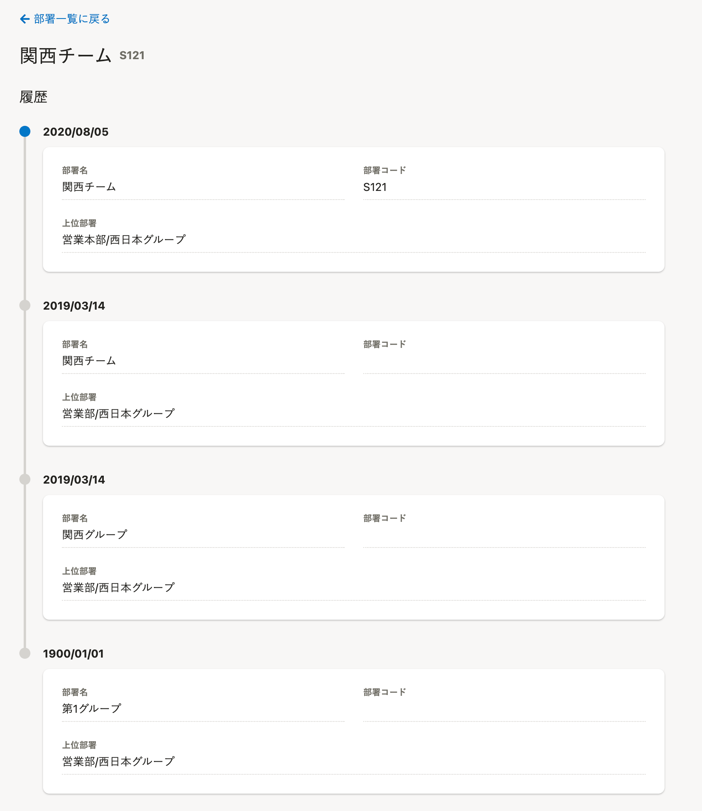
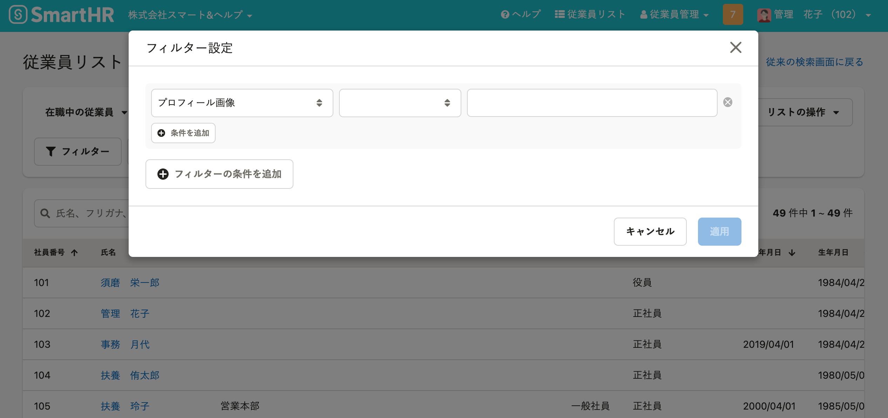
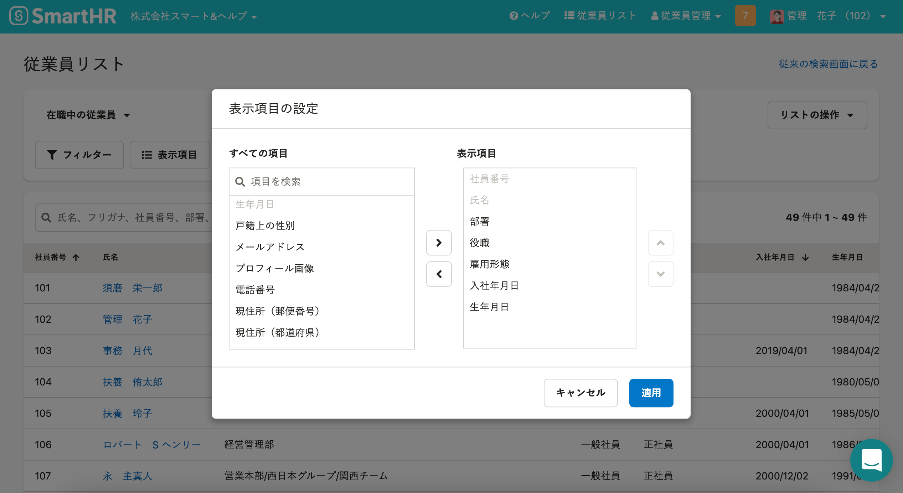

2022年3月15日（火）に行なったアップデートの詳細をお知らせします。

SmartHR基本機能の変更点は、新機能2件・不具合修正1件でした。

# ✨ 新機能

## 部署マスターの履歴を参照できるようにしました

これまでは部署マスターの履歴は参照できず、どの部署マスターがいつからいつまで、どのようなデータとして登録されているかを確認できませんでした。

今回のリリースにより、部署マスターの履歴を参照できるようにしたことで、従業員の異動情報を適切に管理しやすくしました。

:::related
[部署マスターの履歴が閲覧できるようになりました](https://smarthr.jp/update/34072)
:::

 **［共通設定］>［マスターデータ］>［部署］** をクリックし、 **［部署一覧］** から部署名のリンクをクリックすると履歴を参照できます。

## 従業員リストに［プロフィール画像］の項目を追加しました

従業員リストの **［フィルター設定］** と **［表示項目の設定］** に、 **［プロフィール画像］** の項目を追加しました。

 **［フィルター設定］>［フィルター設定］ダイアログ** で **［プロフィール画像］** を指定すると、プロフィール画像の有無で絞り込んで従業員リストを表示できます。

 **［表示項目］>［表示項目の設定］ダイアログ** で **［プロフィール画像］** を指定すると、従業員リストからプロフィール画像を確認できます。

# 👨‍⚕️ 不具合修正

マイナンバーを提供する際の内部動作に関する1件の不具合修正を行ないました。
