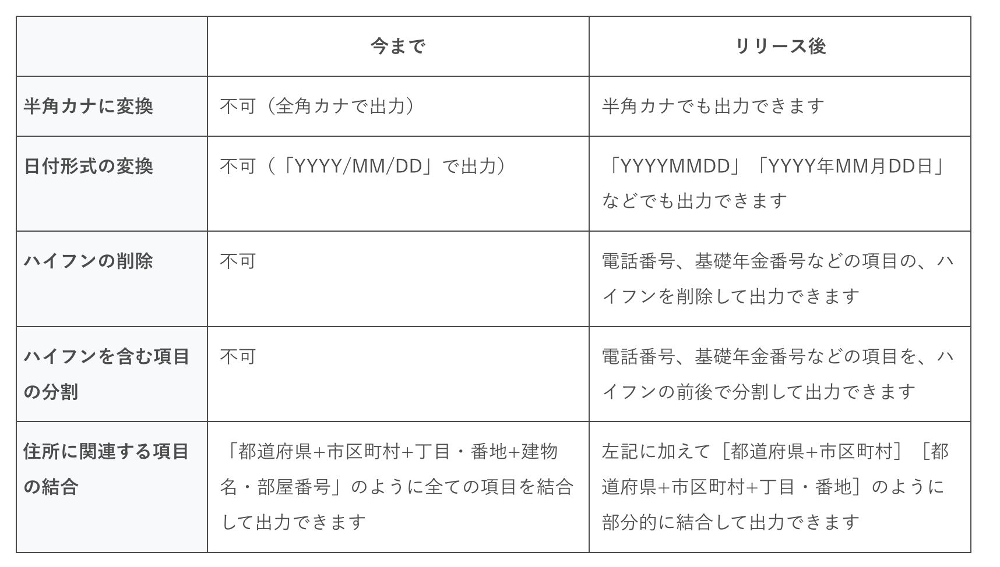

2022年3月24日（木）に行なったアップデートの詳細をお知らせします。

SmartHR基本機能の変更点は、新機能1件・不具合修正1件でした。

# ✨ 新機能

## CSV連携の際に使用するカスタムダウンロードフォーマットの項目に、変換設定を追加しました

連携先の外部サービスによっては、カタカナを「半角カナ」に、日付の項目を「YYYYMMDD」などの形式で取り込む必要があるため、これまではSmartHRからダウンロードしたCSV・Excelファイルを別途変換する必要がありました。

今回の改修により、半角カナや日付の形式などを指定して従業員情報をダウンロードできるようにし、変換作業の手間を減らしました。

:::related
[【CSV連携】半角カナや、日付形式を指定して、従業員情報をダウンロードできるようになりました](https://smarthr.jp/update/34108)
:::

追加した変換設定は以下のとおりです。

### 半角カナに変換、日付形式の変換、ハイフンの削除の設定

 **［カスタムダウンロードフォーマット］** の詳細画面 > **［ダウンロード項目の追加］** をクリックします。

 **［出力形式］** から、 **［半角カナ］** や **［日付形式］** を指定できます。

### 項目の結合、項目の分割の設定

 **［カスタムダウンロードフォーマット］** の詳細画面 > **［ダウンロード項目の追加］** をクリックします。

 **［SmartHRの項目］** のプルダウンメニューから、結合項目・分割項目を指定できます。

詳しい操作方法は、ヘルプページを参照してください。

[【一覧】ダウンロードの際に出力形式を変更できる従業員情報・家族情報の項目](https://knowledge.smarthr.jp/hc/ja/articles/4412174492825)

[従業員情報・家族情報の項目を、結合・分割してダウンロードするには？](https://knowledge.smarthr.jp/hc/ja/articles/4492483701913)

[カスタムダウンロードフォーマットの追加・編集・削除](https://knowledge.smarthr.jp/hc/ja/articles/4404850299289)

# 👨‍⚕️ 不具合修正

特定条件下で申請を提出した際の挙動に関する1件の不具合修正を行ないました。
