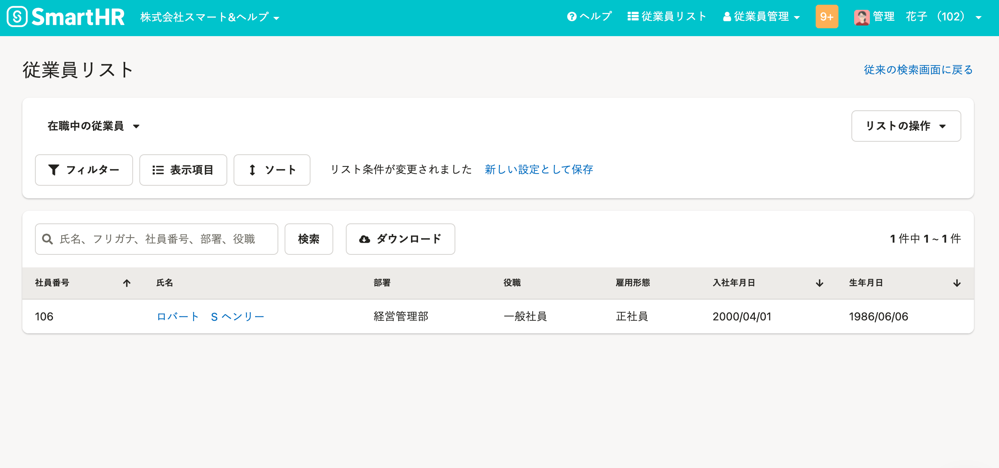
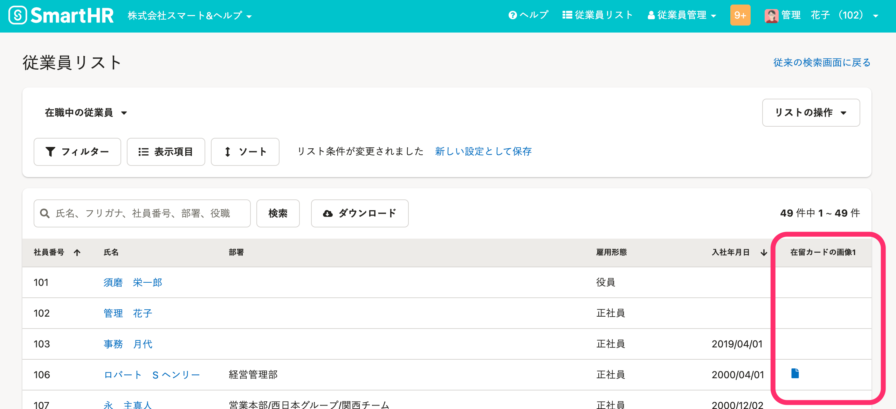

2022年3月30日（水）に行なったアップデートの詳細をお知らせします。

SmartHR基本機能の変更点は、改善1件でした。

# 📈 改善

## 従業員リストの［フィルター設定］と［表示項目の設定］に画像系の項目を追加しました

従業員リストの **［フィルター設定］** と **［表示項目の設定］** に下記項目を追加しました。

- 在留カードの画像1
- 在留カードの画像2
- 雇用保険被保険者証の画像
- 年金手帳の画像
- 障害者手帳の画像
- 勤労学生：学生証の画像
- 本人確認書類1
- 本人確認書類2
- 現住所を確認できる書類
- 履歴書・職務経歴書1
- 履歴書・職務経歴書2
- カスタム従業員項目の **［入力タイプ］** が **［ファイル］** の項目

履歴書・職務経歴書を提出していない従業員を検索したり、従業員リストから画像を直接確認したりできるようになりました。

 **［フィルター設定］>［フィルター設定］ダイアログ** で画像系の項目を指定すると、画像の有無で絞り込んで従業員リストを表示できます。

例：［フィルター設定］で、［在留カードの画像1］が［空ではない］にした場合

 **［表示項目］>［表示項目の設定］ダイアログ** で画像系の項目を指定すると、従業員リストからプロフィール画像を確認できます。

例：［表示項目の設定］で、［在留カードの画像1］を［表示項目］にした場合

