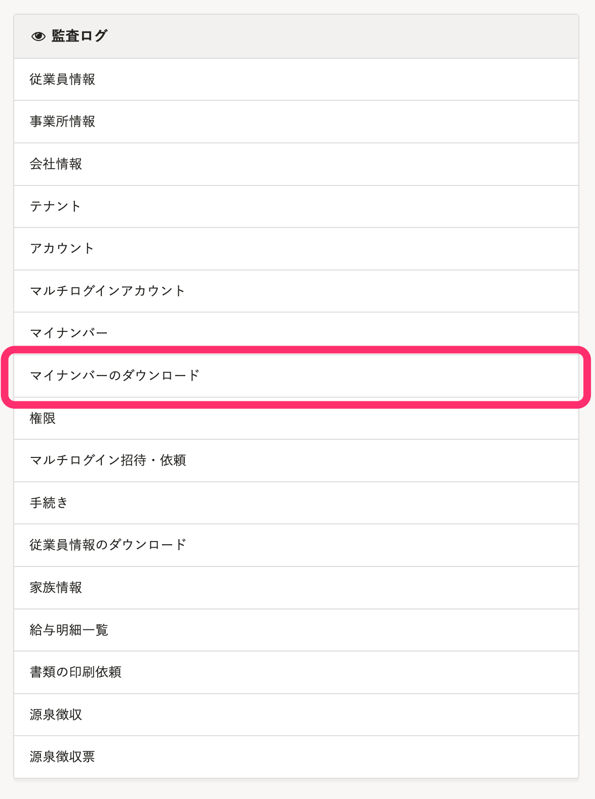

2022年4月5日（火）に行なったアップデートの詳細をお知らせします。

SmartHR基本機能の変更点は、新機能1件・改善2件でした。

# ✨ 新機能

## 申請機能で扶養する家族情報を収集できるようにしました

これまでは、申請フォームの **［家族情報］** 項目で収集できるのは「扶養しない家族」のみで、「社会保険・税法上の扶養状況」 項目は収集できませんでした。

今回のリリースにより、 **［家族情報］** 項目で「扶養する家族」の情報を収集できるようにしました。

また、扶養状況や住所などの項目ごとに、情報を収集する／しないの設定ができます。

登録済みの家族の扶養状況を変更する申請フォームも作成できます。

詳しくは、お知らせを参照してください。

[【4/1更新】申請機能で扶養する家族の情報を収集できるようになります](https://smarthr.jp/update/33815)

申請フォーム登録画面

| 変更前 | 変更後 |
| --- | --- |
|  |  |

:::alert
行政に提出する書類を作成したり、電子申請をしたりする場合は、「扶養追加の手続き」や「扶養削除の手続き」で従業員から情報を収集してください。
[Q. 家族情報を申請で集める際の注意点は？](https://knowledge.smarthr.jp/hc/ja/articles/5141240383001)
:::

# 📈 改善

## 監査ログに［マイナンバーのダウンロード］の項目を追加しました

管理者画面の **［監査ログ］** に、 **［マイナンバーのダウンロード］** の項目を追加しました。

これまでは、マイナンバーの一括ダウンロード履歴は **［マイナンバーの管理］** 画面からのみ確認できていました。

今回の改修により、 **［監査ログ］** 画面からも履歴を参照できるようにしました。

| 変更前 | 変更後 |
| --- | --- |
|  |  |

:::tips
 **［監査ログ］** 画面から確認できるのは、本リリース以降のダウンロード操作についてのみです。
リリース前のダウンロード操作のログは、 **［マイナンバー管理］** 画面 >  **［…］> ［ダウンロード履歴］** から確認してください。

:::

## 年金手帳の廃止にともない、文言を変更しました

2022年4月から年金手帳の新規発行が終わり、基礎年金番号通知書の運用が開始されました。

この法改正にともない、 **［年金手帳］** を **［年金手帳・基礎年金番号通知書］** に変更しました。

対応画面は下記のとおりです。

-  **［従業員情報の一括更新］** 画面
-  **［従業員情報の予約の追加］** 画面
- 入社手続きTodo画面
- 従業員情報、家族情報入力時の **［社会保険］** 項目
- 従業員情報 の **［社会保険］** 項目で画像を変更した際に送信するメール文

例：入社手続きTodo画面

法改正については、[基礎年金番号・年金手帳について｜日本年金機構](https://www.nenkin.go.jp/service/seidozenpan/20131107.html)を参照してください。
