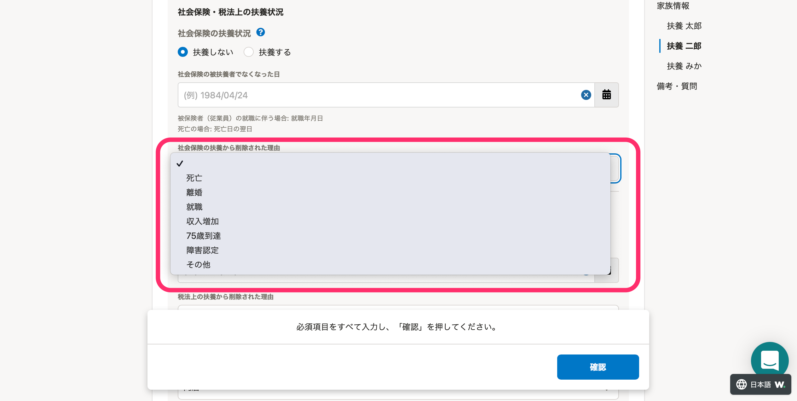

2022年4月7日（木）に行なったアップデートの詳細をお知らせします。

SmartHR基本機能の変更点は、改善2件・アクセシビリティ1件でした。

# 📈 改善

## ［退職年月日］の閲覧権限を制御できるようにしました

これまでは権限設定において従業員情報の **［退職年月日］** は、 **［閲覧］** のチェックが外せなかったため非表示にできない仕様でした。

今回のリリースにより、管理者以外の権限において **［退職年月日］** の **［閲覧］** のチェックを外せるようにし、 **［退職年月日］** の閲覧を制御できるようにしました。

| 変更前 | 変更後 |
| --- | --- |
|  |  |

## 申請プレビュー画面のメッセージバーをスクロールしても表示されるようにしました

これまでは、申請プレビューの画面上部に表示されるメッセージバーが、スクロールすると見えなくなっていました。

今開いているのが実際の申請画面なのかプレビュー画面なのか明示するために、常にメッセージバーが表示されるように画面上部に固定しました。

あわせて、申請入力・申請詳細・申請プレビュー画面で表示される **［申請一覧に戻る］** のリンク位置を調整しました。

# 🎢 アクセシビリティ

## 扶養家族の社会保険・税法上の扶養から削除された理由を多言語対応しました

扶養家族情報を申請する際、社会保険・税法上の扶養状況を **［扶養しない］** にした場合に表示される **［社会保険の扶養から削除された理由］** と **［税法上の扶養から削除された理由］** を、多言語対応しました。

| 日本語 | 英語 |
| --- | --- |
|  |  |
