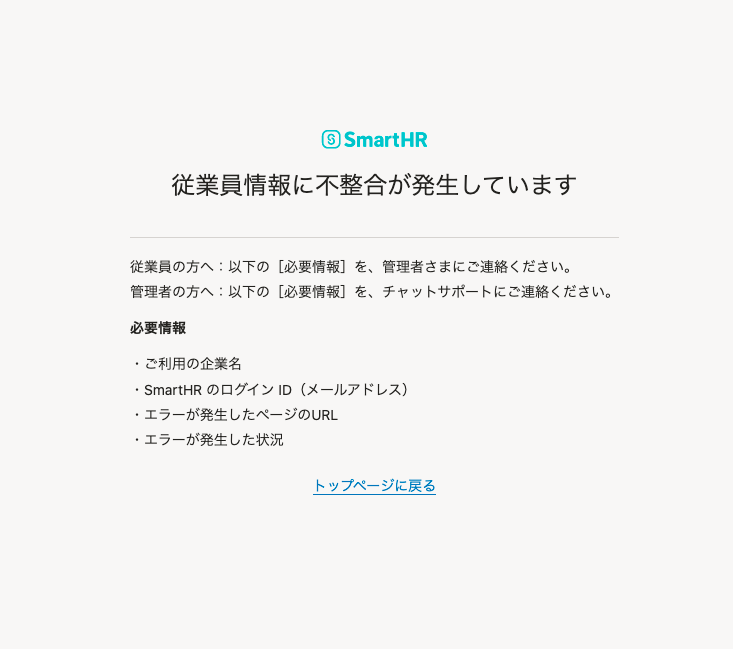

2022年4月12日（火）に行なったアップデートの詳細をお知らせします。

SmartHR基本機能の変更点は、改善1件でした。

# 📈 改善

## 申請の提出・承認の際にエラーだった場合の画面をわかりやすくしました

申請の提出や最終承認をする際に、他のルートで扶養状況が更新され、情報に不整合が発生している場合に表示されるエラー画面をわかりやすくしました。

これまでは、エラーメッセージの内容では原因を特定できず、解決するまでに時間がかかることがありました。

今回の改修により、家族の扶養状況が更新されていることが原因の場合は、エラー内容を明示し原因を特定できるようにしました。

|   | 変更前 | 変更後 |
| --- | --- | --- |
| 提出時 |  |  |
| 承認時 |  |
