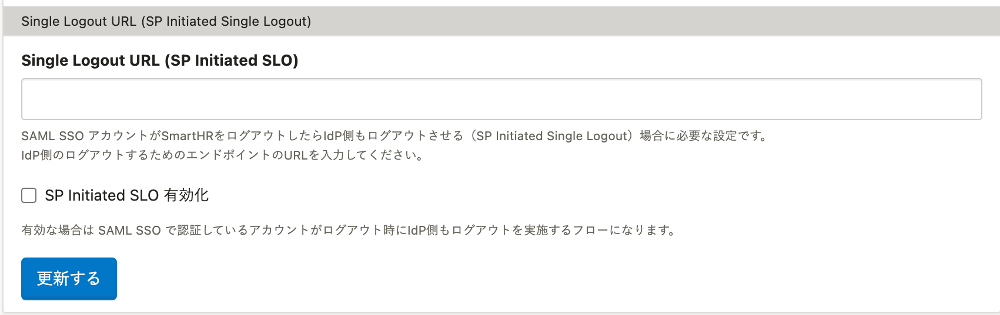
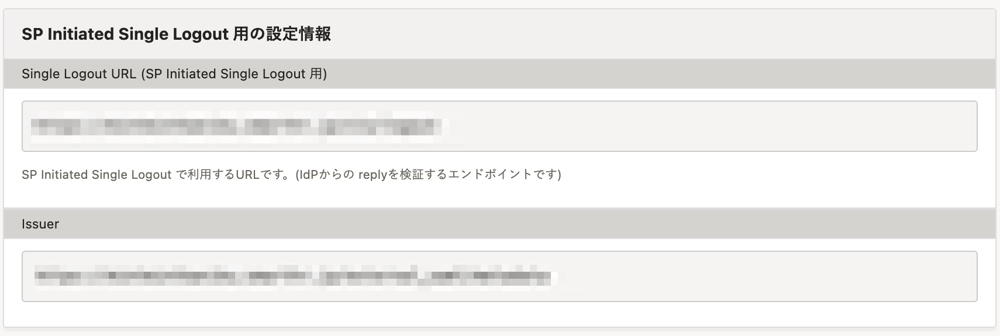

2022年4月15日（金）に行なったアップデートの詳細をお知らせします。

SmartHR基本機能の変更点は、新機能1件・改善1件でした。

# ✨ 新機能

## SAML SSOにSP Initiated SLO機能を追加しました

これまでは、SAML認証（SSO）を設定した場合、従業員がSmartHRからログアウトしても、IdP側ではログアウトできませんでした。

今回リリースしたSP Initiated SLOを設定することで、SmartHRのログアウトと同時にIdP側でもログアウトできるようにしました。

**［共通設定］** > **［SAML SSO設定］** から設定できます。

詳しい設定方法は、下記のヘルプページを参照してください。

[SP Initiated SLOを設定する](https://knowledge.smarthr.jp/hc/ja/articles/5566582741273)

# 📈改善

## SCIMの同期対象に、部署・役職・雇用形態を追加しました

SCIMの同期（sync）対象の項目に、部署・役職・雇用形態を追加しました。

