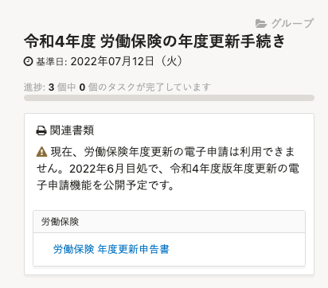
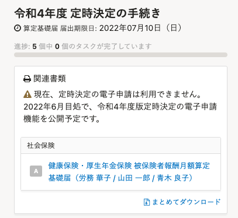
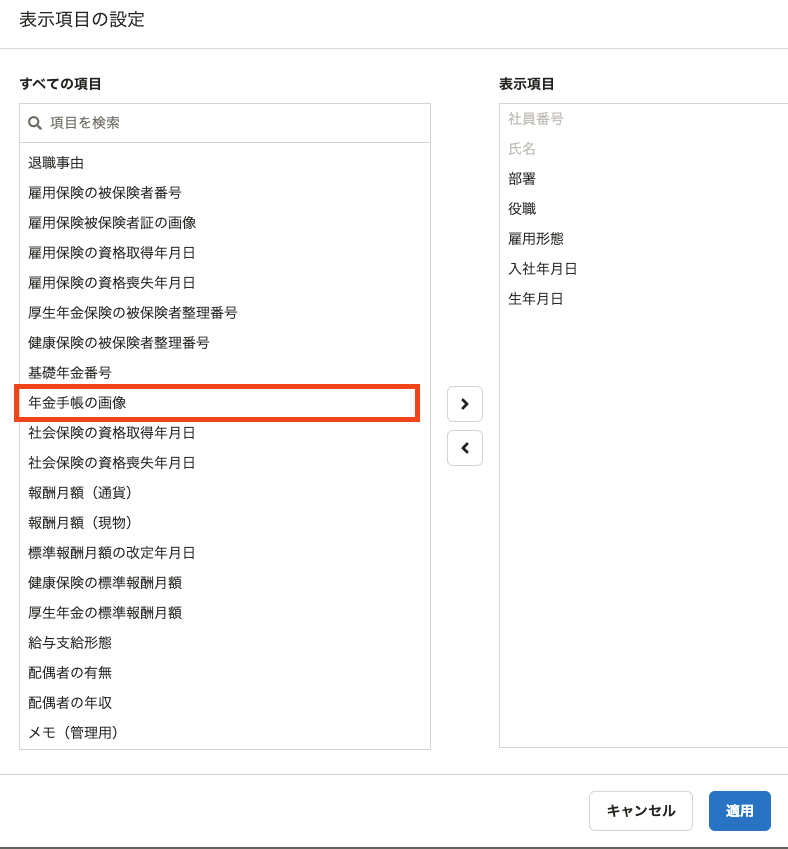
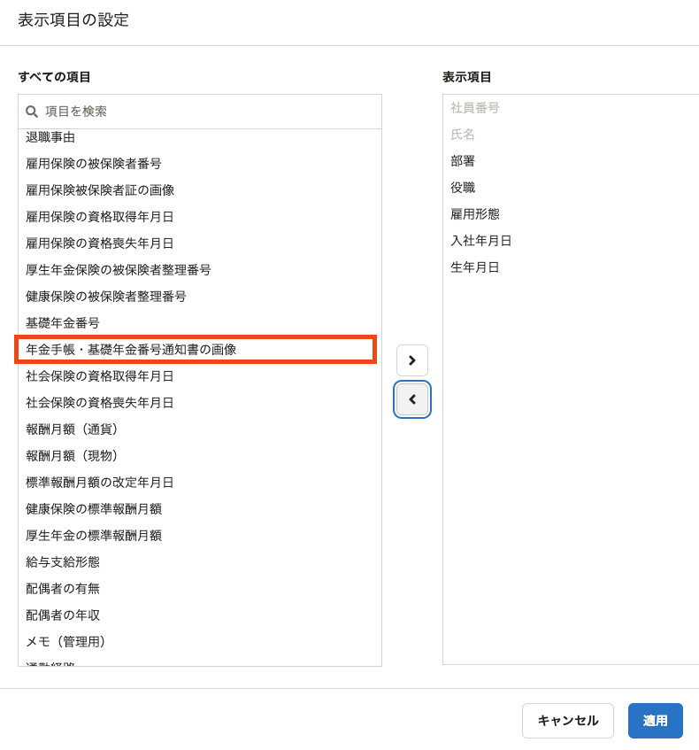

2022年4月19日（火）に行なったアップデートの詳細をお知らせします。

SmartHR基本機能の変更点は、改善2件・不具合修正2件でした。

# 📈改善

## 令和3年度版「労働保険の年度更新手続き」「定時決定の手続き」の電子申請の導線を非表示にしました

現在「労働保険の年度更新手続き」「定時決定の手続き」の電子申請依頼はできないため、各手続き画面の **［電子申請依頼］** を非表示にし、注釈を記載しました。

書類自体の作成は引き続き可能です。

### 労働保険の年度更新手続き

### 定時決定の手続き

## 年金手帳の廃止に伴い、文言を変更しました

2022年4月から年金手帳の新規発行が終わり、基礎年金番号通知書の運用が開始されました。

この法改正に伴い、従業員リストの **［フィルター］>［表示項目］** にあった **［年金手帳の画像］** の項目名を **［年金手帳・基礎年金番号通知書の画像］** に変更しました。

|  変更前  |  変更後  |
| ---- | ---- |
|  |  |

# 👨‍⚕️ 不具合修正

電子申請の「雇用保険被保険者離職証明書」の事業主欄に関する修正など、2件の不具合修正を行ないました。
